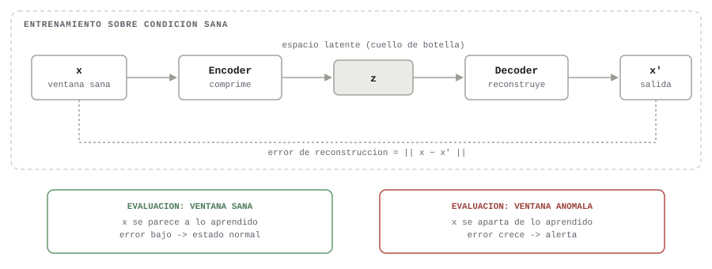

PROYECTO DE TITULACIÓN EN OPCIÓN AL GRADO DE MAGISTER

Título: Arquitectura analítica escalable basada en tecnologías de Big Data para la predicción de anomalías en la degradación de motores robóticos móviles mediante aprendizaje automático y Deep Learning sobre series temporales multivariadas en entornos simulados.

Línea de Investigación:

Ciencias de la ingeniería aplicadas a la producción, sociedad y desarrollo sustentable

Campo amplio de conocimiento:

Tecnologías de la Información y la Comunicación (TIC)

ÍNDICE DE TABLAS

Tabla 1.1. Estadísticos descriptivos de los sensores seleccionados (datos crudos, sin normalizar) .......... [pág.]
Tabla 1.2. Varianza de los 21 sensores originales (datos crudos, orden descendente) .......... [pág.]
Tabla 1.3. Correlación absoluta de cada sensor con el ciclo de operación (orden descendente) .......... [pág.]
Tabla 1.4. Vida útil observada de las trayectorias de motores (NASA C-MAPSS) .......... [pág.]
Tabla 1.5. Variabilidad de las variables de configuración operativa (op_settings) por subconjunto .......... [pág.]
Tabla 1.6. Sensores seleccionados como variables de entrada y criterio de inclusión .......... [pág.]
Tabla 2.1. Evolución de resultados (Spearman / Monotonicidad) a través de las iteraciones de diseño .......... [pág.]
Tabla 2.2. Comparación de modelos de detección de anomalías (conjunto de prueba interno, NASA C-MAPSS) .......... [pág.]
Tabla 2.3. Comparación de modelos sobre el conjunto de prueba externo, por subconjunto (correlación de Spearman) .......... [pág.]
Tabla 2.4. Validación en ROS antes y después de la corrección del criterio de línea base sana .......... [pág.]
Tabla 2.5. Distribución del estado de alerta antes y después del reentrenamiento sobre la corrida extendida ROS .......... [pág.]
Tabla 2.6. Actividades, responsables y recursos de la planificación de la propuesta .......... [pág.]
Tabla 2.7. Indicadores de seguimiento y evaluación de la propuesta .......... [pág.]

ÍNDICE DE FIGURAS

Fig. 1.1. Distribución (histograma) de los 21 sensores originales del Dataset NASA C-MAPSS .......... [pág.]
Fig. 1.2. Matriz de correlación entre los 21 sensores originales del Dataset NASA C-MAPSS .......... [pág.]
Fig. 1.3. Varianza acumulada explicada por las componentes principales del PCA .......... [pág.]
Fig. 1.4. Evolución del índice de salud (Health Index) por ciclo de motor .......... [pág.]
Fig. 1.5. Importancia de los sensores en el índice de salud (Health Index), según PCA .......... [pág.]
Fig. 2.1. Flujo de datos y modelos (arquitectura medallion NASA-ROS) .......... [pág.]
Fig. 2.2. Infraestructura de despliegue Docker .......... [pág.]
Fig. 2.3. Principio de detección de anomalías por reconstrucción (autoencoder) .......... [pág.]
Fig. 2.4. Principio de aislamiento estadístico (Isolation Forest) .......... [pág.]
Fig. 2.5. Evolución del score de anomalía por ciclo y motor (validación ROS) .......... [pág.]
Fig. 2.6. Distribución de estados de alerta antes y después del reentrenamiento (tablero de Grafana) .......... [pág.]

Nota: los campos [pág.] deben completarse con el número de página una vez exportado el documento a Word/PDF. Si en Word insertás cada tabla y figura como "Título" (pestaña Referencias → Insertar título, usando "Tabla" y "Figura" como rótulo y escribiendo el número de capítulo.subíndice manualmente), podés generar automáticamente esta tabla de ilustraciones con Referencias → Insertar tabla de ilustraciones, y los números de página se completan solos.

INFORMACIÓN GENERAL

1. Revisión de literatura

La Industria 4.0 se sostiene sobre la integración de sistemas ciber-físicos, el Internet Industrial de las Cosas (IIoT), la computación en la nube y el análisis masivo de datos (Big Data) con el objetivo de optimizar procesos productivos, incrementar la flexibilidad de manufactura y anticipar fallas antes de que ocurran [1]. Dentro de este paradigma, el mantenimiento predictivo (Predictive Maintenance, PdM) se ha consolidado como una de las aplicaciones de mayor impacto económico y operativo, al permitir sustituir esquemas de mantenimiento correctivo o preventivo programado por esquemas basados en la condición real del equipo, inferida a partir de sus propios datos sensoriales [2]. Una revisión sistemática reciente sobre mantenimiento predictivo basado en aprendizaje automático [2] documenta que redes neuronales, máquinas de vectores de soporte y métodos de conjunto (ensemble) dominan actualmente la detección de fallas en sectores tan diversos como energía eólica, ferrocarriles, manufactura e infraestructura, con mejoras consistentes en precisión de pronóstico, reducción de tiempos de inactividad y disminución de costos operativos.

El problema técnico central del PdM moderno es, en esencia, un problema de detección de anomalías sobre series temporales multivariadas: identificar, a partir de múltiples señales de sensores que evolucionan en el tiempo, el momento en que el comportamiento del sistema se aparta de su condición sana. Wang et al. [3], en una revisión reciente sobre detección profunda de anomalías en series temporales multivariadas, señalan que los métodos basados en reconstrucción —en particular los autoencoders— constituyen uno de los paradigmas dominantes del campo, pues no requieren datos etiquetados de falla (habitualmente escasos o inexistentes en entornos industriales reales) sino que aprenden exclusivamente la distribución de la condición normal y señalan como anómalo todo aquello que el modelo no logra reconstruir con fidelidad. Esta característica resulta particularmente relevante para el presente proyecto, dado que los conjuntos de datos de degradación de motores rara vez cuentan con etiquetas confiables de falla incipiente, pero sí permiten identificar con razonable certeza los ciclos de operación sana iniciales de cada unidad.

El conjunto de datos NASA C-MAPSS (Commercial Modular Aero-Propulsion System Simulation) se ha convertido en el referente estándar para el desarrollo y evaluación de algoritmos de pronóstico de vida útil remanente (Remaining Useful Life, RUL) y detección de fallas incipientes en motores turbofán, debido a su disponibilidad pública, a la diversidad de condiciones operativas que simula y a su uso extendido como banco de pruebas comparativo entre investigaciones [4]. Trabajos recientes que emplean autoencoders LSTM sobre este conjunto de datos han demostrado que es posible detectar fallas incipientes de forma no supervisada —sin necesidad de datos etiquetados de falla— normalizando primero las señales de los sensores mediante regresión en función de las condiciones operativas, y entrenando después el autoencoder exclusivamente sobre segmentos de operación sana, evaluando la anomalía a través de un umbral adaptativo sobre el error de reconstrucción [5]. Esta estrategia metodológica —normalización condicionada por el régimen operativo seguida de un autoencoder entrenado solo con datos sanos— coincide, de forma independiente, con el enfoque adoptado en la etapa de diagnóstico del presente proyecto, lo que ofrece un respaldo adicional en la literatura reciente a las decisiones de diseño tomadas.

Respecto a la arquitectura interna de los modelos de reconstrucción, la elección del tipo de red neuronal condiciona de forma directa su capacidad para capturar la dependencia temporal de la degradación. Las Redes Neuronales Recurrentes (RNN) y, en particular, las redes LSTM (Long Short-Term Memory) han demostrado un desempeño consistente en la modelación de dependencias de largo plazo dentro de secuencias de longitud variable. Como alternativa con menor costo computacional y mayor paralelizabilidad, las Redes Convolucionales Temporales (Temporal Convolutional Networks, TCN) emplean convoluciones causales y dilatadas que garantizan que cada predicción dependa únicamente de observaciones pasadas, alcanzando un campo receptivo amplio sin la naturaleza secuencial —y por tanto más lenta de entrenar— de las redes recurrentes [6]. Más recientemente, las arquitecturas basadas en mecanismos de auto-atención (Transformer), originalmente desarrolladas para el procesamiento de lenguaje natural, se han adaptado con éxito a la detección de anomalías en series temporales industriales, mostrando ventajas en la codificación de dependencias de largo alcance y en la velocidad de inferencia al permitir el procesamiento paralelo de la secuencia completa. La literatura reciente no reporta, sin embargo, un consenso sobre una arquitectura universalmente superior; por el contrario, el desempeño relativo entre arquitecturas recurrentes, convolucionales-causales y de atención depende fuertemente de las características particulares del conjunto de datos y del tipo de degradación a detectar [3], lo que motiva metodológicamente la comparación empírica entre múltiples arquitecturas —y no la adopción a priori de una sola— como parte del diseño del presente proyecto.

Junto a los métodos basados en reconstrucción, la detección de anomalías basada en aislamiento constituye un paradigma alternativo y no supervisado, introducido por Liu et al. [7], que identifica anomalías por el número de particiones aleatorias necesarias para aislarlas del resto de las observaciones, sin requerir el entrenamiento de una red neuronal ni una noción explícita de distancia o densidad. Investigaciones recientes han evidenciado que este enfoque —de naturaleza estadística y no basado en redes neuronales— resulta complementario, y no redundante, frente a los autoencoders: Kumar et al. [8] demuestran que un marco híbrido que integra Isolation Forest, un autoencoder y una red recurrente supera en desempeño a cada técnica aplicada de forma individual, mientras que Guo et al. [9] evidencian que los ensambles diversificados y heterogéneos —que combinan paradigmas de modelado distintos, en lugar de variaciones de un mismo paradigma— mejoran tanto la calidad como la explicabilidad de la detección de anomalías frente a ensambles homogéneos. Esta evidencia respalda la inclusión de Isolation Forest como cuarto modelo del ensamble propuesto en este proyecto, junto a los tres autoencoders (LSTM, TCN y Transformer): no como una alternativa competidora, sino como un criterio de decisión estadísticamente independiente que diversifica el sesgo inductivo del conjunto.

Un segundo eje de literatura relevante para este proyecto es el de la transferencia de aprendizaje (transfer learning) y la adaptación de dominio (domain adaptation) aplicada al mantenimiento predictivo. Yan et al. [10], en una revisión exhaustiva sobre aprendizaje por transferencia profundo para detección de anomalías en series temporales industriales, documentan que el aprendizaje por transferencia ofrece una solución práctica al problema recurrente de la escasez de datos etiquetados en dominios industriales específicos, al permitir aprovechar el conocimiento adquirido en tareas o dominios relacionados —donde sí existe abundancia de datos— y adaptarlo a un dominio objetivo con desplazamiento de distribución (distribution shift) respecto al dominio de origen, requiriendo una cantidad mínima de datos adicionales etiquetados en el dominio destino. En el ámbito específico de motores rotativos, Wang et al. [11] examinan de forma sistemática las técnicas de adaptación de dominio aplicadas a la predicción de vida útil remanente de motores turbofán, proponiendo un marco organizativo que distingue cómo se aplica la adaptación de dominio, dónde ocurre el desplazamiento de distribución y por qué son necesarios ajustes específicos según el origen de dicho desplazamiento —marco directamente aplicable al caso de este proyecto, en el que el desplazamiento de dominio no ocurre entre dos conjuntos de motores turbofán, sino entre motores turbofán (NASA C-MAPSS) y motores DC de robots móviles, un salto de dominio considerablemente más amplio que el habitualmente reportado en la literatura revisada—.

En el contexto latinoamericano y ecuatoriano, la adopción de arquitecturas de Big Data y aprendizaje automático orientadas al mantenimiento predictivo en sistemas robóticos móviles se encuentra todavía en una etapa incipiente. La Comisión Económica para América Latina y el Caribe (CEPAL) [12] documenta que, si bien sectores como la logística de la región han comenzado a incorporar vehículos guiados autónomos y robots para tareas específicas de manipulación de mercancías, persisten brechas estructurales de adopción tecnológica —asociadas a la inestabilidad de la inversión, la limitada disponibilidad de soluciones adaptadas a las necesidades locales y las diferencias frente a economías más desarrolladas— que condicionan la incorporación de tecnologías de Big Data y ciencia de datos en la región —brecha que refuerza la pertinencia de una arquitectura de referencia abierta y reproducible, sustentada en herramientas de código abierto (Apache Kafka, Apache Spark, HDFS), que reduzca la barrera de entrada tecnológica y económica para su adopción por parte de organizaciones de la región—.

Finalmente, cabe destacar antecedentes directos que combinan robótica móvil, streaming de datos y mantenimiento predictivo. Maiz [13] documenta un proyecto desarrollado en el Centro de Formación Somorrostro, en colaboración con el IES Al-Ándalus de Almería, que aplica herramientas de Big Data a un robot móvil autónomo (AMR) MIR250 para la optimización de procesos logísticos, evidenciando que la incorporación de análisis de datos en streaming y pruebas en entornos simulados mejora la toma de decisiones operativas y permite anticipar fallos mediante el análisis continuo de la información generada por el robot. En el ámbito académico ecuatoriano, Lozada [14] propone el proyecto Detectores de Anomalías Impulsados por Datos para Series Temporales y Big Data (DD-ANDET), desarrollado en la Universidad Politécnica Salesiana, orientado a la creación de detectores de anomalías eficientes integrando aprendizaje automático y aprendizaje profundo para el mantenimiento predictivo de equipos industriales y el reconocimiento dinámico de patrones en datos multimodales. En conjunto, la literatura revisada evidencia una convergencia metodológica —autoencoders entrenados sobre condición sana, comparación entre arquitecturas con distinto sesgo inductivo, y transferencia de aprendizaje para superar la escasez de datos etiquetados en el dominio objetivo— que sustenta directamente las decisiones de diseño adoptadas en el presente proyecto, al tiempo que evidencia un vacío específico —la validación empírica de estas técnicas en un salto de dominio amplio (turbofán → motor DC robótico) dentro de una arquitectura de Big Data end-to-end y reproducible— que este trabajo busca atender.

2. Problema de investigación

En la práctica, los sistemas robóticos móviles pueden presentar fallas inesperadas en motores o actuadores debido al desgaste progresivo o a condiciones de operación que no son detectadas oportunamente. Aunque estos sistemas generan grandes volúmenes de datos provenientes de múltiples sensores, dichos datos no siempre son gestionados ni analizados de forma eficiente para identificar comportamientos anómalos de manera temprana, lo que retrasa la intervención de mantenimiento hasta que la falla ya es evidente o, en el peor de los casos, hasta que ocurre una detención no planificada del sistema.

Uno de los principales desafíos radica en la falta de arquitecturas analíticas que permitan integrar la ingesta, almacenamiento y procesamiento de grandes volúmenes de datos sensoriales con técnicas de análisis avanzado y aprendizaje automático. Sin una infraestructura adecuada para gestionar estos datos —capaz de escalar en volumen y velocidad, y de sostener el flujo continuo característico de la telemetría robótica—, se limita la capacidad de aplicar modelos de detección de anomalías que permitan anticipar fallas y apoyar estrategias de mantenimiento predictivo. A este desafío de infraestructura se suma un desafío metodológico: no existe, en la literatura revisada, un consenso sobre qué arquitectura de modelo de aprendizaje automático o profundo resulta más adecuada para detectar la degradación progresiva de un motor a partir de series temporales multivariadas [3], y la evidencia empírica disponible sobre transferencia de conocimiento entre dominios físicamente distintos —como el salto entre motores turbofán y motores DC de robots móviles— es todavía escasa [10], [11].

Adicionalmente, la escasez de datos reales y etiquetados de degradación en motores de robots móviles —a diferencia de dominios como el aeronáutico, donde conjuntos como NASA C-MAPSS han sido recopilados y liberados públicamente durante años— dificulta el entrenamiento directo de modelos de aprendizaje profundo específicos para este dominio. Esta limitación es particularmente relevante en el contexto ecuatoriano y latinoamericano, donde la CEPAL [12] documenta brechas estructurales de adopción tecnológica frente a economías más desarrolladas, en parte debido a la escasez de datos históricos propios y a la falta de arquitecturas de referencia accesibles que puedan adaptarse a las condiciones operativas locales sin requerir una recolección masiva de datos desde cero.

Esta situación genera riesgos operativos, incrementa los costos de mantenimiento y reduce la eficiencia de los sistemas robóticos. Por lo tanto, surge la necesidad de desarrollar soluciones que integren arquitecturas de procesamiento de datos escalables con técnicas de análisis de series temporales multivariadas y modelos de aprendizaje automático y profundo, capaces de aprovechar el conocimiento disponible en dominios con abundancia de datos (como el aeronáutico) y transferirlo hacia dominios con escasez de datos (como la robótica móvil), con el fin de detectar anomalías asociadas a la degradación de motores en robots móviles y mejorar la toma de decisiones en procesos de mantenimiento predictivo.

De lo anterior se deriva la siguiente pregunta problémica que orienta la presente investigación:

¿En qué medida una arquitectura analítica escalable, basada en tecnologías de Big Data y modelos de aprendizaje automático y Deep Learning aplicados a series temporales multivariadas, permite predecir anomalías asociadas a la degradación progresiva de motores robóticos móviles, transfiriendo el conocimiento aprendido a partir de un dominio con abundancia de datos (NASA C-MAPSS) hacia un entorno de simulación robótica basado en ROS con escasez de datos propios?

3. Objetivo general

Diseñar una arquitectura analítica escalable basada en tecnologías de Big Data para la predicción de anomalías en la degradación de motores robóticos móviles, utilizando modelos de aprendizaje automático y Deep Learning aplicados a series temporales multivariadas de sensores en entornos simulados.

4. Objetivos específicos

Obj. Esp. 1 (revisión de literatura): Contextualizar los fundamentos teóricos que abarcan el tema de investigación vinculados con Big Data y Ciencia de Datos aplicados a entornos tecnológicos industriales.

Obj. Esp. 2 (método): Diagnosticar el estado y estructura de los conjuntos de datos mediante técnicas de procesamiento Big Data para su posterior utilización en modelos de aprendizaje automático.

Obj. Esp. 3 (propuesta): Diseñar una arquitectura analítica escalable que automatice los procesos de ingesta, limpieza, almacenamiento y procesamiento de datos, así como los modelos de aprendizaje automático destinados a la predicción de anomalías en degradación de motores robóticos móviles en entornos simulados.

Obj. Esp. 4 (validación e impacto): Validar el desempeño del sistema propuesto mediante métricas estadísticas y criterio de especialistas.

5. Justificación práctica

La solución planteada en el objetivo general —una arquitectura analítica escalable capaz de transferir conocimiento desde un dominio con abundancia de datos hacia un dominio con escasez de datos propios— ofrece una vía práctica y de bajo costo para que organizaciones que operan robots móviles puedan implementar mantenimiento predictivo sin necesidad de recolectar, previamente, años de datos históricos de fallas reales de sus propios equipos, un requisito que en la práctica resulta prohibitivo para la mayoría de las pequeñas y medianas empresas de la región. Al aprovechar un conjunto de datos público y ampliamente validado como NASA C-MAPSS como fuente de conocimiento inicial, y transferir ese conocimiento mediante ajuste fino hacia el dominio específico del motor a monitorear, se reduce sustancialmente el tiempo y el costo de puesta en marcha de un sistema de detección de anomalías funcional.

Asimismo, el hecho de que la arquitectura completa —ingesta con Apache Kafka, almacenamiento distribuido con HDFS, procesamiento con Apache Spark, orquestación mediante contenedores Docker, y visualización con Grafana— esté construida enteramente sobre tecnologías de código abierto elimina la barrera de licenciamiento que suele limitar la adopción de soluciones de Big Data en organizaciones con recursos limitados, un factor de particular relevancia en el contexto ecuatoriano y latinoamericano ya descrito.

Desde el punto de vista técnico, la comparación empírica entre cuatro arquitecturas de modelos (Isolation Forest, autoencoder LSTM, autoencoder TCN y autoencoder Transformer) documentada en este proyecto, junto con la estrategia de fusión de sus resultados, ofrece a futuros implementadores un punto de partida validado empíricamente —no solo teórico— sobre qué arquitectura resulta más adecuada según el criterio de evaluación priorizado (correlación con la degradación real, consistencia de la tendencia, o ambos). Finalmente, la validación de la arquitectura en un entorno de simulación robótica basado en ROS, antes de cualquier despliegue en hardware físico real, permite identificar y corregir limitaciones metodológicas —como las relacionadas con la definición de "condición sana" ante regímenes operativos poco frecuentes, documentadas en este trabajo— a un costo y riesgo considerablemente menores que los que implicaría descubrir dichas limitaciones directamente sobre un robot físico en operación.

6. Vinculación con la sociedad y beneficiarios directos

El presente proyecto de titulación contribuye a la sociedad principalmente a través de tres vías. En primer lugar, mediante la generación de material de estudio y una arquitectura de referencia documentada y de código abierto —publicada en un repositorio público—, que puede ser reutilizada por otros estudiantes, investigadores y profesionales interesados en mantenimiento predictivo basado en Big Data y aprendizaje profundo, reduciendo así la curva de aprendizaje y el costo de entrada a este campo. En segundo lugar, mediante la producción de conocimiento metodológico —los hallazgos sobre normalización por régimen operativo, comparación de arquitecturas y transferencia de aprendizaje entre dominios físicos distintos— con potencial de convertirse en publicaciones académicas, incluyendo revistas de la propia UISRAEL. En tercer lugar, mediante una contribución tecnológica directa: una arquitectura funcional y validada empíricamente que puede adaptarse, con ajustes moderados, a casos de uso reales de mantenimiento predictivo en robótica móvil.

Los beneficiarios directos de este proyecto incluyen: (i) empresas y organizaciones que operan flotas de robots móviles o maquinaria rotativa en sectores como logística, manufactura y agroindustria en Ecuador, que podrían adoptar total o parcialmente la arquitectura propuesta para reducir tiempos de inactividad no planificados; (ii) ingenieros y técnicos de mantenimiento, quienes dispondrían de una herramienta de apoyo a la decisión basada en evidencia estadística y no únicamente en inspección manual; y (iii) la comunidad académica de la UISRAEL y de instituciones afines, que se beneficia del aporte metodológico y de la posible continuidad de esta línea de investigación en futuros trabajos de titulación.

CAPÍTULO I: ESTUDIO DE DIAGNÓSTICO

El propósito de este capítulo es caracterizar o diagnosticar el problema objeto de estudio mediante la recopilación y análisis sistemático de información relevante. Los resultados obtenidos permitirán fundamentar la necesidad de la propuesta de intervención, innovación, desarrollo tecnológico o investigación aplicada que se presenta en los capítulos posteriores.

1.1. Enfoque y tipo de investigación

El presente proyecto tiene un enfoque cuantitativo, debido a que usa datos numéricos que provienen de telemetría sensorial, los cuales son procesados a través de técnicas estadísticas y algoritmos de aprendizaje automático, con la finalidad de detectar comportamientos anómalos, patrones de desgaste y tendencias de degradación. De acuerdo con Hernández-Sampieri [16], un enfoque cuantitativo sigue un orden secuencial de un proceso con el fin de comprobar una hipótesis: partiendo de una idea, de la cual se forman objetivos, preguntas de investigación y el marco teórico, para posteriormente definir variables, diseño de estudio, y recolectar y analizar datos mediante métodos estadísticos con el fin de obtener conclusiones respecto de las hipótesis planteadas.

El tipo de investigación que responde con mayor certeza al presente proyecto es una investigación aplicada, con alcance correlacional y explicativo, ya que se centra en la resolución de un problema práctico —el diseño de una arquitectura analítica escalable para la predicción de anomalías en la degradación de motores, orientada al mantenimiento predictivo— sin la necesidad de manipular variables de un entorno físico real, sino datos simulados en ROS. Según Lozada [15], la investigación aplicada busca resolver problemas de forma práctica y concreta, tratando el problema de forma directa, basándose en hallazgos tecnológicos de la investigación básica, ocupando así un lugar de enlace entre teoría y producto.

Metodológicamente, el estudio se estructura en dos fases complementarias y un diseño mixto no experimental / experimental:

• Fase no experimental (transversal): enfocada en el análisis y modelado de series temporales multivariadas, donde las variables a estudiar no se manipulan de manera deliberada, sino que se observan y analizan a través de datos existentes provenientes de una fuente secundaria (el Dataset NASA C-MAPSS).

• Fase experimental: justificada mediante la validación de la arquitectura en un entorno robótico simulado (ROS), donde sí se manipulan condiciones operativas —perfil de degradación, régimen de carga, velocidad de referencia— con el objetivo de evaluar el comportamiento del modelo y su capacidad de predicción bajo condiciones controladas y un flujo de datos dinámico y continuo.

1.2. Procedimiento del estudio

El procedimiento del estudio diagnóstico se organizó en cuatro fases, cada una construida sobre los resultados de la anterior:

Fase 1 — Diagnóstico y recolección de datos: revisión de literatura sobre detección de anomalías en series temporales multivariadas, arquitecturas de Big Data y transferencia de aprendizaje; planteamiento del problema de investigación; definición del objetivo general y de los objetivos específicos; y selección del Dataset NASA C-MAPSS como fuente de datos, por su disponibilidad pública y su uso extendido como referencia comparativa en la literatura. Esta fase corresponde al Objetivo Específico 1.

Fase 2 — Ejecución de instrumentos: aplicación de los instrumentos de recolección descritos en la sección 1.4 (bases de datos y sensores), mediante la ingesta del conjunto NASA C-MAPSS (formato de texto plano) hacia un data lake distribuido (HDFS).

Fase 3 — Validación de instrumentos: análisis exploratorio de datos (EDA) en profundidad para verificar la calidad y relevancia de la información recolectada, caracterizando escalas, distribuciones, correlaciones, varianza y relevancia de cada sensor respecto a la degradación, detallado en la sección 1.5. Esta fase corresponde al Objetivo Específico 2.

Fase 4 — Análisis de datos: interpretación de los hallazgos obtenidos y su discusión frente a lo reportado por otros autores, fundamentando directamente las decisiones de diseño de la propuesta desarrollada en el Capítulo II, tal como se presenta en la sección 1.6.

El estudio se desarrolló en su totalidad dentro de un entorno de contenedores Docker desplegado en una estación de trabajo local, lo que garantiza la trazabilidad y replicabilidad del procedimiento por parte de otros investigadores, dado que la totalidad del código fuente, los scripts de orquestación y la configuración de la infraestructura se encuentran documentados y disponibles en un repositorio de control de versiones. En cuanto a consideraciones éticas, el estudio no involucra participantes humanos ni datos personales: la fuente primaria de datos (NASA C-MAPSS) es un conjunto de datos público liberado por la NASA para fines de investigación, y los datos del entorno de simulación ROS corresponden a telemetría sintética generada por software, por lo que no existen riesgos de privacidad ni se requirió un proceso de consentimiento informado.

1.3. Participantes y/o unidades de análisis

Dado que el presente proyecto corresponde a un desarrollo tecnológico basado en el análisis de series temporales de sensores —y no a un estudio que involucre personas—, no aplica la definición de una población o muestra de participantes humanos; en su lugar, la unidad de análisis corresponde a los datos sensoriales de series temporales multivariados correspondientes a la degradación de motores a través del tiempo (ciclos de operación).

La población de estudio está conformada por los registros del Dataset NASA C-MAPSS, para lo cual se optó por un muestreo no probabilístico de tipo censal, ya que la selección de la muestra no hace uso de la probabilidad estadística, sino que depende del criterio técnico del investigador y de las características puntuales del estudio [16]. Se hace uso de una muestra perteneciente a un subconjunto del Dataset train, con 161 000 registros correspondientes a 709 trayectorias de motores, con el fin de realizar el respectivo análisis para entender patrones, tendencias, variabilidad y degradación, y poder efectuar la selección de características (features) para el posterior entrenamiento, evaluación y validación de los modelos. Este conjunto de datos fue seleccionado por conveniencia, dada su alta aceptación en investigaciones relacionadas con el análisis de fallas, la detección de anomalías y el mantenimiento predictivo, así como por su confiabilidad, precisión y disponibilidad pública [4], [5].

Como criterio de inclusión para el ajuste (fit) de la línea base de "condición sana" de cada trayectoria de motor, se emplea el primer 30% de los ciclos de operación de cada unidad, bajo el supuesto metodológico de que la degradación mecánica es mínima al inicio de la vida operativa del componente; los ciclos restantes de cada trayectoria se excluyen del ajuste de dicha línea base, aunque se incluyen en la evaluación del modelo. Como punto adicional, complementario a la muestra —y no como parte de ella— se emplean datos simulados generados en un entorno virtual ROS, cuyo propósito no es ampliar el tamaño muestral, sino realizar la validación técnica del modelo propuesto bajo condiciones de operación dinámica y flujo continuo de datos, propias de la fase experimental ya descrita.

1.4. Técnicas e instrumentos de recopilación de información

Dado que el presente estudio no involucra la aplicación de instrumentos de recolección de información con personas (encuestas, entrevistas), la recolección de datos se sustenta en dos pares de técnica e instrumento:

• Técnica: análisis de fuente secundaria, es decir, el aprovechamiento de datos ya recopilados y publicados previamente por un tercero, sin intervención del investigador en su generación.
  Instrumento: bases de datos — el Dataset público NASA C-MAPSS (subconjuntos FD001 a FD004), como fuente primaria de datos de entrenamiento y prueba interna; y una base de datos relacional PostgreSQL, diseñada para el almacenamiento estructurado de los resultados de evaluación interna, externa y de validación en ROS.

• Técnica: captura directa de señal, es decir, el registro automatizado y continuo de lecturas en el punto de origen, sin mediar un formulario o una persona que reporte la información.
  Instrumento: sensores (simulados) — telemetría multivariada de variables de configuración operativa (op_settings) y lecturas de sensores (temperatura, presión, velocidad, entre otras en el caso de NASA C-MAPSS; corriente, revoluciones, temperatura y voltaje en el caso del motor DC simulado en ROS), generada a una frecuencia de muestreo configurable y publicada en tiempo real mediante un nodo de mensajería.

El software especializado, los algoritmos de análisis y la infraestructura de orquestación empleados para procesar la información recolectada mediante estos dos instrumentos —al no ser en sí mismos instrumentos de recolección de datos, sino parte del desarrollo tecnológico de la propuesta— se describen en detalle en el Capítulo II.

1.5. Resultados - Análisis de datos

Como parte del diagnóstico del conjunto de datos ya descrito, se realizó un análisis exploratorio de datos (EDA) en profundidad sobre el subconjunto del Dataset NASA C-MAPSS, documentado íntegramente en el notebook pipeline_bigdata_tesis.ipynb. La depuración y codificación de los datos se realizó mediante Apache Spark (PySpark), estructurando la información en las capas bronze (datos crudos en HDFS) y silver (datos limpios en formato Parquet); el análisis descriptivo, estadístico y de selección de variables se realizó con pandas, Matplotlib, Seaborn y scikit-learn (para el análisis de componentes principales), complementado con Tableau como herramienta de visualización interactiva. A continuación se presentan los hallazgos obtenidos, los cuales fundamentan directamente las decisiones de diseño de la propuesta presentada en el Capítulo II.

1.5.1. Estadística descriptiva y escalas de los sensores

El conjunto de datos analizado está compuesto por 160 359 registros correspondientes a 709 trayectorias de motores (28 columnas: identificadores, ciclo, 3 variables de configuración operativa —op_setting_1 a op_setting_3— y 21 sensores). El análisis estadístico descriptivo (media, desviación estándar, cuartiles) evidenció escalas marcadamente distintas entre sensores: por ejemplo, el sensor_9 presenta una media de 8677.6 con una desviación estándar de 374.7, mientras que el sensor_16 presenta una media de 0.025 con una desviación estándar de 0.005 —una diferencia de varios órdenes de magnitud—. Esta disparidad de escalas justifica la necesidad de una normalización estadística previa a cualquier comparación entre señales o a su uso conjunto como entrada de un modelo de aprendizaje automático. La Tabla 1.1 resume los estadísticos descriptivos de los 11 sensores finalmente seleccionados como variables de entrada (ver selección en el apartado 1.5.6), donde se aprecia la misma disparidad de escalas en el subconjunto efectivamente utilizado por los modelos.

Tabla 1.1. Estadísticos descriptivos de los sensores seleccionados (datos crudos, sin normalizar)

| Sensor | Media | Desv. estándar | Mínimo | Máximo |
|---|---|---|---|---|
| sensor_2 | 597.36 | 42.48 | 535.48 | 645.11 |
| sensor_3 | 1467.04 | 118.18 | 1242.67 | 1616.91 |
| sensor_4 | 1260.96 | 136.30 | 1023.77 | 1441.49 |
| sensor_7 | 359.73 | 174.13 | 136.17 | 570.81 |
| sensor_8 | 2273.83 | 142.43 | 1914.72 | 2388.64 |
| sensor_9 | 8677.55 | 374.66 | 7984.51 | 9244.59 |
| sensor_11 | 44.21 | 3.43 | 36.04 | 48.53 |
| sensor_14 | 8088.95 | 80.62 | 7845.78 | 8293.72 |
| sensor_15 | 9.05 | 0.75 | 8.16 | 11.07 |
| sensor_17 | 360.70 | 31.02 | 302.00 | 400.00 |
| sensor_21 | 15.57 | 7.02 | 6.01 | 23.95 |

El análisis de los histogramas individuales de cada sensor, presentado en la Fig. 1.1, evidenció que, en general, los sensores no siguen una distribución normal, presentando en varios casos distribuciones multimodales —es decir, con varios picos—, lo cual es consistente con la existencia de distintos regímenes de operación y distintas fases de degradación dentro de un mismo sensor. Se identificaron visualmente tres sensores con comportamiento prácticamente plano o constante: sensor_13, sensor_16 y sensor_19.

[FIG. 1.1 A INSERTAR — Grilla de histogramas individuales de los 21 sensores (50 bins cada uno). Corresponde a la celda `df_eda[sample_sensors].hist(figsize=(12,8), bins=50)` de la sección "2.1. Histogramas Individuales de variables sensoriales" del notebook pipeline_bigdata_tesis.ipynb. Exportar con `plt.savefig("figura_1_1_histogramas.png", dpi=200, bbox_inches="tight")` antes del `plt.show()`. Pie sugerido: "Fig. 1.1. Distribución (histograma) de los 21 sensores originales del Dataset NASA C-MAPSS, evidenciando distribuciones no normales y, en varios casos, multimodales."]

1.5.2. Matriz de correlación y redundancia entre sensores

La matriz de correlación calculada sobre los 21 sensores, presentada en la Fig. 1.2, evidenció una alta correlación positiva entre un número considerable de pares de sensores, lo que indica redundancia informativa —es decir, múltiples sensores midiendo fenómenos físicos similares—. En particular, se observó una correlación positiva moderada entre los sensores 13 y 19, consistente con el hallazgo de que ambos presentan un comportamiento plano (baja varianza), lo que sugiere que miden fenómenos similares pero con distinta intensidad de señal. En contraste, el sensor_15 presentó una correlación negativa considerablemente más fuerte que el resto de sensores respecto del conjunto general, lo que lo señala como un posible indicador crítico y temprano de degradación, motivo por el cual se incluyó en el análisis de tendencia temporal que se presenta a continuación. La alta redundancia observada motivó la exploración de técnicas de reducción de dimensionalidad —en particular, Análisis de Componentes Principales (PCA)— para evitar decisiones arbitrarias sobre qué sensor individual aporta mayor información dada su alta intercorrelación.

[FIG. 1.2 A INSERTAR — Matriz de correlación entre los 21 sensores (mapa de calor). Corresponde a la celda de salida de `sns.heatmap(corr, cmap="coolwarm", center=0)` en la sección "2.2. Matriz de Correlación entre variables" del notebook pipeline_bigdata_tesis.ipynb. Exportar la imagen desde Jupyter (clic derecho → guardar imagen, o `plt.savefig("figura_1_1_correlacion.png", dpi=200, bbox_inches="tight")` justo antes del `plt.show()`) e insertarla aquí como Fig. 1.2, con el pie: "Fig. 1.2. Matriz de correlación entre los 21 sensores originales del Dataset NASA C-MAPSS."]

1.5.3. Análisis de varianza y relevancia respecto al ciclo de operación

Como filtro preliminar para detectar sensores con aporte informativo prácticamente nulo, se calculó la varianza de cada sensor sobre los datos crudos (antes de normalizar). Los resultados —ordenados de mayor a menor varianza y resumidos en la Tabla 1.2— ubicaron al sensor_9 (140 368.2) y al sensor_7 (30 322.6) como los de mayor varianza absoluta, y al sensor_16 (0.000025) y al sensor_10 (0.020) como los de menor varianza, prácticamente constantes independientemente de la escala en la que operan. Se concluyó que estos dos últimos sensores no aportarían información relevante para la detección de degradación, por lo que fueron excluidos como candidatos a variable de entrada de los modelos.

Tabla 1.2. Varianza de los 21 sensores originales (datos crudos, orden descendente)

| Sensor | Varianza | Sensor | Varianza |
|---|---|---|---|
| sensor_9 | 140 368.21 | sensor_20 | 136.69 |
| sensor_7 | 30 322.59 | sensor_21 | 49.21 |
| sensor_12 | 26 959.50 | sensor_6 | 41.52 |
| sensor_18 | 20 309.99 | sensor_19 | 21.68 |
| sensor_8 | 20 285.34 | sensor_5 | 18.19 |
| sensor_4 | 18 577.71 | sensor_11 | 11.74 |
| sensor_3 | 13 965.39 | sensor_15 | 0.56 |
| sensor_13 | 12 358.16 | sensor_10 | 0.020 |
| sensor_14 | 6 500.11 | sensor_16 | 0.000025 |
| sensor_2 | 1 804.42 | | |
| sensor_17 | 962.33 | | |
| sensor_1 | 925.40 | | |

De forma complementaria, se calculó la correlación de cada sensor con la variable cycle (número de ciclo de operación), como indicador indirecto de asociación con la degradación progresiva del motor (Tabla 1.3). Los sensores con mayor correlación absoluta con el ciclo fueron sensor_14 (0.098), sensor_11 (0.043), sensor_16 (0.043), sensor_4 (0.036), sensor_9 (0.033), sensor_17 (0.030) y sensor_3 (0.030); los de menor correlación fueron sensor_13 (0.0015) y sensor_19 (0.0007), junto con los sensores 1, 5, 6, 8 y 18. Resulta particularmente relevante el caso del sensor_16, que pese a su varianza casi nula presenta una correlación relativamente alta con el ciclo, lo que sugiere que, aunque opera en una escala muy reducida, podría representar una señal de degradación genuina o reflejar cambios abruptos de tendencia asociados a cambios de régimen operativo —una primera señal exploratoria del fenómeno de cambio de régimen que se retoma más adelante—.

Tabla 1.3. Correlación absoluta de cada sensor con el ciclo de operación (orden descendente)

| Sensor | \|Correlación\| | Sensor | \|Correlación\| |
|---|---|---|---|
| sensor_14 | 0.0985 | sensor_21 | 0.0106 |
| sensor_11 | 0.0434 | sensor_20 | 0.0105 |
| sensor_16 | 0.0430 | sensor_5 | 0.0100 |
| sensor_4 | 0.0364 | sensor_1 | 0.0095 |
| sensor_9 | 0.0332 | sensor_6 | 0.0094 |
| sensor_17 | 0.0299 | sensor_8 | 0.0059 |
| sensor_3 | 0.0298 | sensor_18 | 0.0053 |
| sensor_10 | 0.0174 | sensor_13 | 0.0015 |
| sensor_15 | 0.0170 | sensor_19 | 0.0007 |
| sensor_12 | 0.0136 | | |
| sensor_7 | 0.0135 | | |
| sensor_2 | 0.0127 | | |

La visualización de la evolución temporal de sensores seleccionados (en particular sensor_15) por motor y por subconjunto (FD001 a FD004) confirmó visualmente patrones de degradación progresiva a lo largo del ciclo de vida de los motores, sustentando el enfoque predictivo del proyecto. El análisis mediante diagramas de caja del sensor_9 por motor evidenció, además, diferencias notables de dispersión y valores atípicos aislados entre motores, señalando posibles candidatos a anomalía y motores con mayor sensibilidad al desgaste. Finalmente, la comparación del sensor_15 entre los cuatro subconjuntos (FD001–FD004) evidenció que cada subconjunto opera bajo condiciones operativas distintas, lo que llevó a la conclusión metodológica de que la normalización de los sensores no debe aplicarse de forma global, sino condicionada a la situación operativa de cada motor —decisión de diseño que se desarrolla en el capítulo siguiente—.

1.5.4. Reducción de dimensionalidad mediante PCA y construcción de un índice de salud (Health Index)

Dada la alta redundancia identificada en la matriz de correlación, se aplicó un Análisis de Componentes Principales (PCA) sobre los 21 sensores estandarizados, cuya varianza acumulada explicada por componente se presenta en la Fig. 1.3, construyendo a partir de la primera componente principal un índice de salud (health index) por ciclo y por motor.

[FIG. 1.3 A INSERTAR — Curva de varianza explicada acumulada por componente principal. Corresponde a la celda `plt.plot(pca.explained_variance_ratio_.cumsum(), marker='o')` de la sección de PCA del notebook. Exportar con `plt.savefig("figura_1_2_pca_varianza.png", dpi=200, bbox_inches="tight")` antes del `plt.show()`. Pie sugerido: "Fig. 1.3. Varianza acumulada explicada por las componentes principales del PCA sobre los 21 sensores estandarizados."]

La visualización de este índice a lo largo del ciclo de vida de distintos motores, presentada en la Fig. 1.4, evidenció de forma consistente una tendencia de degradación progresiva, la cual se suavizó adicionalmente mediante una media móvil (ventana de 10 ciclos) para reducir el ruido de alta frecuencia y facilitar su interpretación visual.

[FIG. 1.4 A INSERTAR — Evolución del índice de salud (Health Index) por ciclo para uno o varios motores, original y suavizado. Corresponde a las celdas que grafican `health_index` y `health_index_smooth` en el notebook (motor de ejemplo: índice 640 del listado de engine_id). Exportar de la misma forma. Pie sugerido: "Fig. 1.4. Evolución del índice de salud (PC1) a lo largo del ciclo de vida del motor, señal original y suavizada (media móvil de 10 ciclos)."]

La extracción de los pesos (loadings) de la primera componente principal permitió, además, cuantificar el aporte relativo de cada sensor a dicho índice de salud, información que se empleó como criterio adicional —junto con el análisis de varianza y de correlación con el ciclo— para la selección final de variables.

A modo de prueba exploratoria del potencial del índice de salud como mecanismo de detección de anomalías, se identificaron como anómalos aquellos ciclos en los que la variación (diferencia de primer orden) del índice de salud excedía el percentil 98 o era inferior al percentil 5 de su propia distribución, calculado sobre un motor individual (FD001_18). Este ejercicio exploratorio, aunque no constituye por sí mismo el mecanismo de detección final de la arquitectura propuesta (que se basa en el ensamble de modelos descrito en el Capítulo II), evidenció de forma preliminar que las desviaciones abruptas de un índice de salud agregado son capaces de señalar puntos de interés coincidentes con episodios de degradación, reforzando la viabilidad general de un enfoque basado en la desviación respecto de una condición de referencia sana.

1.5.5. Caracterización de la vida útil y de las condiciones operativas

El análisis de la vida útil observada (número máximo de ciclos alcanzado por cada uno de los 709 motores), resumido en la Tabla 1.4, mostró una media de 226.2 ciclos, con una desviación estándar de 66.4, un mínimo de 128 ciclos, una mediana de 207 ciclos y un máximo de 543 ciclos, evidenciando una variabilidad considerable en la duración de vida útil entre motores, incluso dentro de un mismo subconjunto.

Tabla 1.4. Vida útil observada de las trayectorias de motores (NASA C-MAPSS)

| Estadístico | Valor |
|---|---|
| Motores analizados | 709 |
| Vida útil media (ciclos) | 226.2 |
| Desv. estándar | 66.4 |
| Mínimo | 128 |
| Mediana | 207 |
| Máximo | 543 |

Un hallazgo diagnóstico particularmente relevante surgió del análisis descriptivo de las tres variables de configuración operativa (op_setting_1, op_setting_2 y op_setting_3) por subconjunto (Tabla 1.5): en los subconjuntos FD001 y FD003, las tres variables permanecen prácticamente constantes a lo largo de toda la trayectoria de cada motor (op_setting_3 se mantiene fija en 100.00, y las otras dos presentan desviaciones estándar del orden de 0.002 o menores), mientras que en los subconjuntos FD002 y FD004 las tres presentan una variabilidad considerablemente mayor (desviaciones estándar de 14.7 en op_setting_1, 0.31 en op_setting_2 y 14.2 en op_setting_3), lo que indica que estos motores operan bajo múltiples condiciones operativas distintas a lo largo de su vida útil.

Tabla 1.5. Variabilidad de las variables de configuración operativa (op_settings) por subconjunto

| Subconjunto | Variable | Media | Desv. estándar | Rango |
|---|---|---|---|---|
| FD001 | op_setting_1 | ≈ 0.00 | 0.0022 | −0.0087 a 0.0087 |
| FD001 | op_setting_2 | ≈ 0.00 | 0.0003 | −0.0006 a 0.0006 |
| FD001 | op_setting_3 | 100.00 | 0.00 | constante en 100.00 |
| FD002 | op_setting_1 | 24.00 | 14.75 | 0.00 a 42.01 |
| FD002 | op_setting_2 | 0.57 | 0.31 | 0.00 a 0.84 |
| FD002 | op_setting_3 | 94.05 | 14.24 | 60.00 a 100.00 |
| FD003 | op_setting_1 | ≈ 0.00 | 0.0022 | −0.0086 a 0.0086 |
| FD003 | op_setting_2 | ≈ 0.00 | 0.0003 | −0.0006 a 0.0007 |
| FD003 | op_setting_3 | 100.00 | 0.00 | constante en 100.00 |
| FD004 | op_setting_1 | 24.00 | 14.78 | 0.00 a 42.01 |
| FD004 | op_setting_2 | 0.57 | 0.31 | 0.00 a 0.84 |
| FD004 | op_setting_3 | 94.03 | 14.25 | 60.00 a 100.00 |

Esta heterogeneidad de las condiciones operativas en FD002/FD004 constituye la observación diagnóstica inicial que, analizada con mayor profundidad durante el desarrollo de la propuesta, condujo a la identificación del fenómeno de cambio de régimen operativo y a la estrategia de normalización condicionada por régimen que se describe en el capítulo siguiente.

1.5.6. Selección final de variables (features)

A partir de los criterios estadísticos descritos en los apartados anteriores —varianza (exclusión de sensores casi constantes), redundancia por correlación (evitando incluir múltiples sensores altamente correlacionados sin aporte diferencial), correlación con el ciclo de operación (relevancia respecto de la degradación) y peso relativo dentro del índice de salud obtenido por PCA, presentado en la Fig. 1.5—, complementados con la validación visual mediante Tableau, se definió el conjunto final de 11 sensores empleados como variables de entrada de los modelos de detección de anomalías (Tabla 1.6).

[FIG. 1.5 A INSERTAR — Importancia de los sensores en el índice de salud (PCA), gráfico de barras horizontales con el valor absoluto del peso (loading) de cada sensor en la primera componente principal, ordenado de mayor a menor. Corresponde a la celda que construye `loadings_sorted` a partir de `pca.components_[0]` y grafica `plt.barh(loadings_sorted["sensor"], loadings_sorted["abs_weight"])` en el notebook pipeline_bigdata_tesis.ipynb. Exportar con `plt.savefig("figura_1_5_importancia_pca.png", dpi=200, bbox_inches="tight")` antes del `plt.show()`. Pie sugerido: "Fig. 1.5. Importancia de los sensores en el índice de salud (Health Index), medida como el valor absoluto del peso de cada sensor en la primera componente principal del PCA."] Este conjunto, registrado en el artefacto selected_features.json, se utiliza de forma consistente en todas las etapas posteriores del pipeline (preprocesamiento, entrenamiento, evaluación y validación en ROS), garantizando la trazabilidad de la selección de variables descrita en este apartado.

Tabla 1.6. Sensores seleccionados como variables de entrada y criterio de inclusión

| Sensor | Varianza | Correlación con el ciclo | Criterio principal de inclusión |
|---|---|---|---|
| sensor_9 | Alta (140 368.2) | Media-alta (0.033) | Mayor varianza absoluta del conjunto |
| sensor_7 | Alta (30 322.6) | Baja-media (0.013) | Alta varianza, no redundante |
| sensor_4 | Alta (18 577.7) | Alta (0.036) | Varianza y relevancia con el ciclo |
| sensor_3 | Alta (13 965.4) | Alta (0.030) | Varianza y relevancia con el ciclo |
| sensor_2 | Media (1 804.4) | Baja (0.013) | Complementa el subconjunto sin redundancia |
| sensor_17 | Media (962.3) | Alta (0.030) | Relevancia con el ciclo |
| sensor_8 | Alta (20 285.3) | Baja (0.006) | Alta varianza; peso relevante en el índice de salud (PCA) |
| sensor_11 | Baja (11.7) | Alta (0.043) | Correlación con el ciclo pese a varianza baja |
| sensor_14 | Media (6 500.1) | La más alta (0.098) | Mayor correlación con el ciclo del conjunto |
| sensor_15 | Muy baja (0.56) | Media (0.017) | Mayor correlación negativa en la matriz de correlación (indicador temprano) |
| sensor_21 | Baja (49.2) | Baja (0.011) | Complementa el subconjunto sin redundancia |

Excluidos por varianza casi nula: sensor_10 y sensor_16. Excluidos por redundancia y bajo aporte diferencial pese a su varianza (alta correlación cruzada con otros sensores ya incluidos): sensor_1, sensor_5, sensor_6, sensor_12, sensor_13, sensor_18, sensor_19 y sensor_20.

1.6. Discusión

Los hallazgos del análisis exploratorio de datos presentados en el apartado anterior son, en términos generales, consistentes con el conocimiento científico revisado al inicio de este documento, al tiempo que revelan características específicas del conjunto de datos que orientan directamente las decisiones de diseño de la propuesta. La ausencia de normalidad y la multimodalidad observadas en las distribuciones individuales de los sensores son coherentes con lo señalado en la literatura sobre datos industriales de sensores, donde la coexistencia de distintos regímenes operativos y fases de degradación dentro de una misma señal es un fenómeno documentado [3] y no una particularidad exclusiva de este conjunto de datos. De igual manera, la alta redundancia informativa evidenciada en la matriz de correlación es consistente con el hecho de que los 21 sensores originales de NASA C-MAPSS miden, en muchos casos, fenómenos físicos relacionados entre sí (temperaturas y presiones en distintas etapas del mismo motor), lo que justifica metodológicamente la reducción de dimensionalidad aplicada mediante PCA y la posterior selección de un subconjunto de 11 sensores no redundantes.

El hallazgo más relevante desde el punto de vista diagnóstico —la marcada diferencia de variabilidad de las condiciones operativas entre subconjuntos, con FD001 y FD003 operando bajo una condición prácticamente constante frente a FD002 y FD004 con una variabilidad de más de un orden de magnitud superior— no es un dato anecdótico, sino la primera evidencia empírica de un fenómeno que, según se determinó en el desarrollo de la propuesta, tiene consecuencias directas sobre la validez de cualquier estrategia de normalización que no lo considere explícitamente. Este hallazgo es coherente con la literatura sobre desplazamiento de distribución (distribution shift) en series temporales industriales [10], que documenta de forma general el riesgo de que cambios legítimos en las condiciones de operación de un sistema se confundan con anomalías si el modelo no los distingue explícitamente, aunque dicha literatura no profundiza, para el caso específico de NASA C-MAPSS, en la magnitud ni en la frecuencia de este fenómeno —brecha que este proyecto aborda de forma cuantitativa más adelante—.

Asimismo, la identificación del sensor_15 como el sensor con la correlación más fuerte (negativa) respecto del resto del conjunto, y del sensor_16 como un caso particular de señal de baja varianza pero relativamente alta correlación con el ciclo de operación, evidencian que un análisis puramente basado en la varianza no habría sido suficiente para una selección de variables robusta: fue necesario combinar múltiples criterios estadísticos complementarios (varianza, correlación cruzada, correlación con el ciclo y peso en el índice de salud por PCA) para llegar a una selección de variables metodológicamente defendible, coherente con la práctica recomendada en la literatura de ingeniería de características para mantenimiento predictivo [2].

En síntesis, el diagnóstico realizado sobre el conjunto de datos NASA C-MAPSS —escalas heterogéneas que requieren normalización, alta redundancia entre sensores que motiva la reducción de dimensionalidad, un subconjunto reducido de sensores con mayor relevancia respecto a la degradación, y una heterogeneidad relevante en las condiciones operativas entre subconjuntos— constituye la base empírica que fundamenta la necesidad de la propuesta que se presenta a continuación. En particular, la heterogeneidad de condiciones operativas identificada en este capítulo es la que motiva, de forma directa, el diseño de una estrategia de normalización condicionada por régimen operativo y de un mecanismo de transferencia de aprendizaje hacia el dominio de simulación ROS, cuyo desarrollo, resultados y validación empírica se documentan enseguida.

CAPÍTULO II: PROPUESTA

Frente al problema diagnosticado en el capítulo anterior, la propuesta de este trabajo consiste en construir esa misma arquitectura analítica escalable que da nombre al proyecto, con un propósito concreto: predecir anomalías en la degradación de motores robóticos móviles a partir de sus datos de sensores. No se trata, entonces, de un componente más entre varios, sino del objeto central que este capítulo desarrolla de principio a fin. Para ello, primero se exponen los fundamentos científico-tecnológicos que la sustentan (sección 2.1); luego se describe cómo se articulan sus componentes de Big Data e inteligencia artificial (sección 2.3.1); después se detalla su planificación y los indicadores con que se le dio seguimiento (secciones 2.3.2 y 2.3.3); y finalmente se presenta la evidencia empírica —obtenida de la validación ya ejecutada— de que la arquitectura efectivamente predice dicha degradación y genera los resultados esperados (sección 2.3.4).

2.1. Fundamentos de la propuesta

La propuesta técnica que se desarrolla en este capítulo se fundamenta en un conjunto de herramientas y patrones arquitectónicos propios del ecosistema de Big Data, seleccionados para responder a las exigencias de volumen, velocidad y variedad que caracterizan a la telemetría de sensores en sistemas robóticos móviles —justificación que se sustenta empíricamente en la sección 2.3.1—.

Para la ingesta de datos se adopta Apache Kafka, un sistema de mensajería distribuida que permite recibir telemetría de forma continua y desacoplada de su procesamiento posterior, escalando horizontalmente mediante particiones y brokers adicionales conforme crece el volumen o la velocidad de los datos entrantes; su adopción como capa de ingesta en arquitecturas de analítica IoT orientadas al mantenimiento predictivo está respaldada por trabajos recientes que documentan patrones arquitectónicos equivalentes [17].

Para el almacenamiento se adopta HDFS (Hadoop Distributed File System), organizado conforme al patrón de arquitectura medallion —bronze, silver y gold—, un estándar ya consolidado en la industria para el procesamiento escalable de datos de sensores en contextos de Internet Industrial de las Cosas [18]: la capa bronze preserva los datos crudos sin transformar; la capa silver los limpia y estructura; y la capa gold los enriquece con las características que los modelos de aprendizaje automático requieren como entrada.

Para el procesamiento se adopta Apache Spark, un motor de procesamiento distribuido capaz de operar tanto por lotes como en streaming, responsable de ejecutar las transformaciones entre las tres capas medallion y de correr, de forma distribuida, el entrenamiento y la evaluación de los modelos; su combinación con Kafka como motor de extracción, transformación y carga (ETL) sobre flujos de datos IoT es igualmente documentada en la literatura reciente sobre arquitecturas de mantenimiento predictivo [17].

Para el componente analítico se adopta un ensamble de algoritmos de aprendizaje automático y profundo especializados en detección de anomalías no supervisada —Isolation Forest y tres autoencoders con distinto sesgo inductivo (LSTM, TCN y Transformer)—, complementado con una estrategia de transferencia de aprendizaje entre dominios. Los principios científico-tecnológicos que fundamentan la elección de cada uno de estos algoritmos se desarrollan en detalle en la sección 2.3.1, dentro del apartado de diseño del modelado.

Para la persistencia de resultados se adopta PostgreSQL, una base de datos relacional que almacena de forma estructurada las predicciones y métricas generadas por el ensamble; y para su visualización se adopta Grafana, mediante tableros de control interactivos que exponen dichos resultados al usuario final.

Finalmente, la totalidad de estos componentes se orquesta mediante Docker y Docker Compose, lo que garantiza la reproducibilidad del despliegue en cualquier estación de trabajo compatible y constituye, en sí misma, la base de la escalabilidad de la arquitectura: cada componente escala de forma independiente —más nodos de datos en HDFS, más workers en Spark, más particiones y brokers en Kafka, más réplicas de contenedores— sin requerir un rediseño del sistema al crecer el volumen o la velocidad de los datos sensoriales.

2.2. Objetivo e impacto esperado

2.2.1. Objetivo general de la propuesta

Implementar una arquitectura analítica escalable —integrada por un pipeline de ingesta y procesamiento de datos, un ensamble de cuatro modelos de detección de anomalías, y un mecanismo de transferencia de aprendizaje entre dominios— orientada a la predicción de anomalías de degradación en motores robóticos móviles a partir de series temporales multivariadas de sensores, y validada empíricamente tanto en el dominio de entrenamiento (NASA C-MAPSS) como en un dominio destino con escasez de datos (simulación ROS).

2.2.2. Beneficiarios o usuarios previstos

Dado que este trabajo corresponde a un proyecto de investigación aplicada y no a una implementación desplegada en una organización real, los beneficiarios identificados a continuación se distinguen en dos niveles: uno inmediato, que se beneficia de la investigación en sí misma sin requerir adopción posterior, y otro previsto o potencial, que se beneficiaría en caso de que la arquitectura llegara a adoptarse. El beneficiario inmediato es la comunidad académica interesada en extender esta arquitectura a otros tipos de maquinaria rotativa o a datos reales de sensores físicos, la cual puede acceder, replicar y continuar este trabajo a partir de su sola publicación. Como beneficiarios previstos se identifican organizaciones que operan robots móviles o maquinaria rotativa y requieren monitoreo de condición sin contar con años de datos históricos de falla propios, así como ingenieros y técnicos de mantenimiento que requieren una herramienta de apoyo a la decisión basada en evidencia estadística.

2.2.3. Resultados esperados a corto, mediano y largo plazo

A corto plazo (ya alcanzado durante el desarrollo de este proyecto): una arquitectura analítica escalable funcional de extremo a extremo, documentada, reproducible y validada empíricamente sobre datos reales generados en el entorno de simulación ROS, con tableros de control (Grafana) operativos para la visualización de resultados. A mediano plazo: ciclos sucesivos de reentrenamiento de los modelos a partir de nuevos datos simulados generados en ROS, con el fin de mejorar progresivamente su capacidad de aprendizaje y, en consecuencia, la precisión de la predicción de anomalías asociadas al desgaste del motor. A largo plazo: pruebas de mayor escala mediante la inyección de volúmenes crecientes de datos simulados, con el fin de evaluar el comportamiento operativo de la arquitectura bajo carga sostenida y determinar su sostenibilidad como sistema de procesamiento escalable.

2.2.4. Impacto esperado en la población, organización o contexto de aplicación

Cabe precisar que el alcance de este trabajo se mantiene íntegramente dentro de un entorno de simulación (ROS) y no incluye una implementación real sobre un robot físico; el impacto que se describe a continuación es, por lo tanto, un impacto potencial, condicionado a una eventual adopción o extensión futura de la arquitectura más allá de dicho alcance, y no un resultado ya alcanzado por este proyecto. Bajo ese supuesto, se esperaría que la adopción de la arquitectura propuesta, o de sus componentes metodológicos, contribuyera a reducir los tiempos de inactividad no planificados y los costos asociados al mantenimiento correctivo de emergencia en sistemas robóticos móviles, incrementando la confiabilidad operativa de dichos sistemas. A nivel de organización, se esperaría reducir la barrera de entrada tecnológica y económica para la adopción de mantenimiento predictivo en pequeñas y medianas empresas de la región, al basarse íntegramente en tecnologías de código abierto y en una estrategia de transferencia de aprendizaje que no requiere la recolección previa de grandes volúmenes de datos de falla propios.

2.3. Propuesta

2.3.1. Desarrollo de la propuesta

La escalabilidad de la arquitectura no es una característica declarativa, sino una propiedad que se sostiene en el propio diseño de cada capa: el almacenamiento (HDFS) escala añadiendo nodos de datos, el procesamiento (Apache Spark) escala añadiendo workers al clúster, la ingesta (Apache Kafka) escala mediante particiones y brokers adicionales, y el despliegue completo (Docker Compose) escala mediante la réplica de contenedores — todo ello sin requerir un rediseño del sistema al crecer el volumen o la velocidad de los datos sensoriales. Su componente analítico, por su parte, corresponde al ensamble de cuatro modelos de aprendizaje automático y profundo cuyo diseño se detalla más adelante en esta misma sección.

Más allá de la escalabilidad de su diseño, corresponde justificar por qué este proyecto constituye, en la práctica, un problema de Big Data. Siguiendo el modelo de caracterización aplicado recientemente a datos físico-sensoriales por Ma et al. [18], dicha caracterización se sustenta en tres dimensiones: volumen, velocidad y variedad. Es importante precisar que el volumen no se interpreta aquí como el número de registros —un criterio que, por sí solo, puede ser engañoso—, sino como el peso real de los datos generados, criterio bajo el cual el conjunto NASA C-MAPSS (161 000 registros, unas decenas de megabytes) no constituye, en rigor, el componente de volumen del proyecto; dicho componente corresponde más bien a la telemetría ROS ingerida por lotes, cuyo peso crece de forma acumulativa con cada corrida de publicación. Una primera corrida de validación (documentada en la sección 2.3.4) generó 12 187 mensajes en aproximadamente 9 minutos (3 motores a 10 Hz), equivalentes a 1.2 MB en la capa bronze de HDFS —una prueba de concepto de la tubería de ingesta, todavía por debajo del orden de magnitud de referencia (del orden de 1 GB) considerado adecuado para hablar de volumen en sentido estricto—. A partir de esa prueba de concepto, se ejecutó una corrida extendida con 6 motores simulados en paralelo (2 por cada perfil de degradación) sostenida durante varias horas, alcanzando 1 030 277 mensajes reales publicados hacia Kafka y procesados a través de la tubería completa (bronze-silver-gold), equivalentes a 94.8 MB en la capa bronze de HDFS (sin contar el factor de replicación de HDFS, que eleva el espacio físico ocupado a 284.5 MB). Este resultado confirma, con una corrida ya ejecutada y no solo proyectada, que la arquitectura sostiene un volumen del orden de decenas a un centenar de megabytes bajo el esquema de mensaje actual; acercarse al orden de 1 GB de referencia seguiría requiriendo corridas sostenidas considerablemente más largas, o bien un esquema de telemetría de mayor detalle por mensaje, lo cual se documenta como trabajo futuro. La velocidad, por su parte, está validada empíricamente: la ingesta mediante Apache Kafka sostuvo una tasa combinada de 60 mensajes por segundo (6 motores a 10 Hz cada uno) de forma continua durante la corrida extendida, sin pérdida de mensajes ni caída de los procesos publicadores. La variedad, por su parte, se sustenta en la heterogeneidad real de las fuentes integradas por la arquitectura: datos por lotes en texto plano (NASA), telemetría en streaming en formato JSON (ROS/Kafka), almacenamiento distribuido en Parquet (HDFS) y almacenamiento relacional (PostgreSQL) —heterogeneidad de fuentes y formatos consistente con la reportada en sistemas de monitoreo IoT basados en sensores [19].

La propuesta constituye, en consecuencia, un sistema de software compuesto por los siguientes elementos:

Arquitectura. La arquitectura medallion presentada en la sección 2.1 organiza el almacenamiento del sistema en tres capas sobre HDFS. La capa bronze recibe los datos crudos, sin ninguna transformación: telemetría ingerida en tiempo real desde el simulador ROS mediante Apache Kafka (o, en un despliegue futuro, desde sensores físicos), y el conjunto NASA C-MAPSS ingerido por lotes; ambos se preservan tal cual llegan. La capa silver limpia y estructura esos datos crudos mediante Apache Spark —tipado, deduplicación, filtrado de valores atípicos—, todavía sin ninguna transformación orientada al modelado. La capa gold enriquece los datos silver con las características que los modelos requieren como entrada —normalización condicionada por régimen operativo y la variable cycles_since_regime_change—, también mediante Apache Spark, dejando el conjunto listo para el entrenamiento.

Sobre esta base de tres capas se apoyan los componentes restantes de la arquitectura: el ensamble de cuatro algoritmos de detección de anomalías, cuyo diseño se detalla en el apartado "Diseño (algoritmos)" más adelante en esta sección, entrenado y evaluado directamente sobre la capa gold; PostgreSQL, para el almacenamiento estructurado de las predicciones y métricas resultantes; y Grafana, para su visualización mediante tableros de control interactivos. La totalidad de los componentes se orquesta mediante Docker Compose, lo que garantiza la reproducibilidad del despliegue en cualquier estación de trabajo compatible. La Fig. 2.1 resume el flujo de datos y modelos entre ambos dominios, y la Fig. 2.2 detalla la infraestructura de contenedores que lo soporta.

Casos de uso. Se identifican tres casos de uso principales: (a) entrenamiento y comparación de modelos sobre el conjunto NASA C-MAPSS; (b) adaptación de dominio y ajuste fino de los modelos preentrenados hacia un nuevo dominio con datos propios escasos, ejemplificado en este proyecto mediante el entorno de simulación ROS; y (c) monitoreo continuo, en el que nueva telemetría es evaluada mensaje a mensaje contra los modelos ya ajustados a medida que se recibe, generando un estado de alerta (saludable, advertencia o crítico) visualizable en los tableros de control. Este tercer caso de uso está soportado por un componente de inferencia diseñado para operar directamente sobre el flujo de Kafka; sin embargo, el alcance de la validación empírica reportada en este trabajo (sección 2.3.4) se definió sobre el flujo por lotes descrito en esta misma sección, y no sobre el streaming continuo de extremo a extremo.

Diseño (algoritmos). El diseño del ensamble de detección se sustenta en cuatro principios científico-tecnológicos, cada uno con un papel distinto dentro del conjunto, que en conjunto explican por qué se eligió cada algoritmo y no otro.

El primer principio es el de detección de anomalías por reconstrucción. La idea, en el fondo, es sencilla: un autoencoder es una red neuronal entrenada para reproducir su propia entrada, obligada a hacerlo a través de un cuello de botella —una representación intermedia de menor dimensión, llamada espacio latente—. Si ese entrenamiento se realiza exclusivamente con datos de condición sana, la red termina aprendiendo, de forma implícita, los patrones que caracterizan la normalidad del sistema; nunca aprende a reconocer una falla, porque nunca la ve durante el entrenamiento. En consecuencia, cuando se le presenta una observación que se aparta de esos patrones —por ejemplo, la señal de un motor que comienza a degradarse—, el error de reconstrucción tiende a crecer, y ese crecimiento sostenido constituye, en sí mismo, la evidencia de que algo se apartó de lo aprendido como normal [3]. Esta lógica resulta particularmente útil aquí porque resuelve una limitación práctica habitual del mantenimiento predictivo: la ausencia casi total de datos etiquetados de falla. Rara vez existen ejemplos históricos de fallas ya catalogadas; lo que sí suele abundar es telemetría de operación normal. El principio de reconstrucción convierte esa limitación en una ventaja metodológica, y es el fundamento común de los tres autoencoders del ensamble. La Fig. 2.3 esquematiza este principio: la misma ventana de entrada atraviesa el encoder, el espacio latente y el decoder, pero el error resultante es bajo cuando la ventana es sana y crece cuando se aparta de la normalidad aprendida.

Ahora bien, entrenar un autoencoder no basta por sí solo: la forma en que la red procesa la secuencia temporal —su sesgo inductivo— determina qué tipo de patrones es capaz de capturar, y por eso se evaluaron tres arquitecturas con sesgos distintos en lugar de conformarse con una sola. Las redes LSTM incorporan mecanismos de memoria explícitos —puertas de entrada, de olvido y de salida— que les permiten retener información relevante a lo largo de secuencias prolongadas, lo que las hace apropiadas cuando la relación entre observaciones distantes en el tiempo importa para la tarea. Las redes TCN resuelven el mismo problema desde otro ángulo: emplean convoluciones causales, que garantizan que la salida en un instante dado dependa únicamente del pasado y nunca del futuro, combinadas con dilatación, que expande exponencialmente el campo receptivo de la red sin disparar proporcionalmente el número de parámetros; el resultado práctico es que una TCN captura dependencias de largo alcance con un costo computacional considerablemente menor al de una red recurrente, y con la ventaja adicional de admitir entrenamiento paralelo en lugar de secuencial [6]. La tercera arquitectura, el Transformer, prescinde por completo tanto de la recurrencia como de la convolución: un mecanismo de auto-atención pondera la relevancia de cada posición de la secuencia respecto de todas las demás simultáneamente, y una codificación posicional explícita preserva la noción de orden temporal que de otro modo se perdería al eliminar la recurrencia. Comparar estas tres familias no es un ejercicio sin consecuencias prácticas: cada una asume una forma distinta de dependencia temporal, y ninguna domina de forma universal sobre las demás, razón que justifica integrarlas en un ensamble en lugar de apostar por una única red.

Un tercer principio, de naturaleza distinta a los dos anteriores, es el de detección de anomalías basada en aislamiento. A diferencia de los autoencoders, el algoritmo Isolation Forest no reconstruye nada: parte de una observación estadística simple —que las anomalías, al ser puntos infrecuentes y distintos del resto de la distribución, requieren en promedio menos particiones aleatorias del espacio de características para quedar aisladas que una observación típica— y construye un ensamble de árboles de partición aleatoria para medir precisamente eso [7]. Su inclusión no es redundante frente a los tres autoencoders: al tratarse de un método estadístico y no de una red neuronal, aporta un criterio de decisión independiente, y evidencia reciente respalda que combinar aislamiento estadístico con reconstrucción neuronal produce resultados complementarios y no simplemente repetidos [8], [9], lo cual explica su papel dentro de la estrategia de fusión del ensamble. La Fig. 2.4 ilustra la intuición detrás de este mecanismo: un punto ubicado dentro de un grupo denso de observaciones requiere varios cortes aleatorios del espacio para quedar aislado, mientras que un punto alejado del grupo queda aislado con muy pocos cortes.

El cuarto principio es transversal a los tres anteriores, en el sentido de que no propone un modelo nuevo, sino una forma de reutilizar los ya entrenados: la transferencia de aprendizaje mediante congelamiento selectivo de parámetros (fine-tuning). El problema que resuelve es concreto: existe un dominio de origen con datos abundantes (NASA C-MAPSS) y un dominio destino con datos escasos (el motor DC simulado en ROS), y entrenar un modelo desde cero sobre este último sería, en la práctica, poco viable. Yan et al. [10] y Wang et al. [11] documentan que, ante este tipo de desplazamiento de distribución entre dominios, es posible preservar el conocimiento general ya aprendido congelando las capas responsables de dicho conocimiento —el codificador, en el caso de los autoencoders empleados aquí— y reentrenando únicamente las capas responsables de la representación específica del nuevo dominio, es decir, el decodificador. Reducir además la tasa de aprendizaje durante ese reentrenamiento evita que gradientes de mayor magnitud terminen por borrar el conocimiento adquirido previamente, un riesgo conocido en la literatura como olvido catastrófico.

Sobre esta base, el ensamble combina los cuatro modelos mediante una lógica de fusión en la que el estado crítico se dispara si al menos uno de los tres autoencoders (LSTM, TCN o Transformer) reporta condición crítica, empleando el Isolation Forest como criterio de confirmación secundario. Esta lógica de fusión por disyunción (OR) prioriza la sensibilidad del sistema —minimizar falsos negativos ante una posible falla real— sobre la especificidad, decisión de diseño justificada por el mayor costo relativo de una falla no detectada frente al de una alerta que posteriormente resulte no confirmada.

Base de datos. El esquema de PostgreSQL se organiza en tres familias de tablas: evaluación interna (métricas y predicciones sobre el conjunto de prueba de NASA C-MAPSS), evaluación externa (métricas ponderadas y resumen sobre datos de prueba independientes) y evaluación ROS (predicciones y métricas de la validación en el entorno de simulación robótica, incluyendo el ciclo de primera advertencia y primer estado crítico por motor).

Interfaces. La interfaz principal para la operación de la arquitectura corresponde a un conjunto de scripts de orquestación (run_nasa_stage1.sh, run_nasa_stage2.sh, run_ros_publishers.sh, run_ros_batch.sh, run_ros_live.sh, run_ros_retrain.sh) que exponen cada etapa del pipeline como un comando independiente y parametrizable, permitiendo tanto la ejecución completa del flujo como la re-ejecución selectiva de etapas individuales. La interfaz de visualización para el usuario final corresponde a los tableros de control de Grafana, que exponen el score de anomalía de cada modelo y motor a lo largo del tiempo, así como tablas resumen del estado del sistema.

Normalización de la condición operativa. A partir del hallazgo diagnóstico del capítulo anterior —la marcada heterogeneidad de condiciones operativas en los subconjuntos FD002 y FD004—, la etapa de preprocesamiento de la propuesta contempló inicialmente la segmentación de los regímenes operativos del motor mediante agrupamiento no supervisado (K-Means) sobre las variables de configuración operativa (op_settings), seguida de una estandarización (z-score) ajustada de forma independiente para cada clúster, utilizando únicamente los ciclos sanos del conjunto de entrenamiento como referencia. Un análisis diagnóstico más profundo evidenció que, en dichos subconjuntos, la condición operativa cambia en aproximadamente el 82.5% de los ciclos consecutivos, de modo que el 100% de las ventanas temporales de 30 ciclos utilizadas por los modelos abarcan más de un régimen operativo, introduciendo discontinuidades en la señal normalizada no asociadas a la degradación real del motor, sino al cambio discreto de línea base entre clústeres.

Con el propósito de mitigar este efecto, se sustituyó la normalización discreta por clúster por una línea base continua, obtenida mediante regresión polinómica (grado 2) de cada sensor en función de las variables operativas, ajustada exclusivamente sobre los ciclos sanos —un enfoque metodológicamente convergente con el propuesto de forma independiente por Sánchez et al. [5] para la detección no supervisada de fallas incipientes sobre este mismo conjunto de datos—. Si bien esta modificación produjo mejoras marginales en las métricas de detección, el análisis comparativo del salto de señal entre ciclos con y sin cambio de régimen no mostró una reducción sustancial (FD002: razón de 1.155 a 1.149; FD004: de 1.168 a 1.202), lo que permitió concluir que la discontinuidad observada no se debe primordialmente al método de normalización, sino que constituye evidencia de una dinámica transitoria propia del sistema —el tiempo de estabilización de los sensores tras un cambio de condición operativa—, dado que en los subconjuntos FD002/FD004 la condición operativa transiciona entre un número reducido de puntos discretos y no de forma continua.

A partir de este hallazgo, se incorporó una variable adicional, cycles_since_regime_change, que cuantifica el número de ciclos transcurridos desde el último cambio de régimen operativo detectado, la cual se integró como una característica adicional de entrada a los modelos (además de los 11 sensores ya seleccionados en el diagnóstico). Esta modificación permitió a los modelos distinguir explícitamente entre una transición reciente de régimen y un proceso de degradación progresiva, obteniendo mejoras consistentes en las métricas de correlación con la degradación real (ver Tabla 2.1, iteración 3, en el Capítulo II).

Comparación de arquitecturas de aprendizaje automático y profundo. Se evaluaron cuatro modelos no supervisados, entrenados exclusivamente sobre ventanas de 30 ciclos correspondientes a condición sana, y evaluados mediante tres métricas: (i) correlación de Spearman entre el score de anomalía y el RUL invertido, que mide la capacidad del modelo para detectar la tendencia de degradación; (ii) diferencia de score entre zona sana y zona crítica (early_late_delta); y (iii) monotonicidad, que cuantifica la consistencia de la tendencia ascendente del score conforme el motor se aproxima al fallo.

Para contextualizar cómo se llegó a esta configuración final, la Tabla 2.1 resume la evolución de las métricas a lo largo de las cuatro iteraciones de diseño realizadas: desde la línea base con el autoencoder CNN original, pasando por la corrección de su cuello de botella, la normalización por regresión y la incorporación de la variable cycles_since_regime_change, hasta el reemplazo final del CNN por TCN y Transformer.

Tabla 2.1. Evolución de resultados (Spearman / Monotonicidad) a través de las iteraciones de diseño

| Iteración | LSTM_AE | CNN_AE / TCN_AE / Transformer_AE |
|---|---|---|
| 0. Línea base | 0.774 / 0.356 | CNN: 0.640 / 0.041 |
| 1. CNN con cuello de botella real | 0.774 / 0.356 | CNN: 0.640 / 0.097 |
| 2. + normalización por regresión | 0.782 / 0.348 | CNN: 0.669 / 0.081 |
| 3. + feature cycles_since_regime_change | 0.798 / 0.356 | CNN: 0.671 / 0.074 |
| 4. CNN → TCN + Transformer (configuración final) | 0.798 / 0.356 | TCN: 0.693 / 0.192 · Transformer: 0.695 / 0.243 |

La comparación inicial incluyó un autoencoder convolucional (CNN) que, pese a exhibir el menor error de reconstrucción, presentó sistemáticamente el desempeño más bajo en monotonicidad (0.041), evidenciando una limitada capacidad para capturar la tendencia temporal de degradación. El análisis arquitectónico permitió identificar que dicha limitación no obedece a restricciones de cómputo ni a la calidad de los datos, sino al diseño mismo del modelo: la proyección final del autoencoder combina la representación aplanada de la ventana temporal mediante una capa completamente conectada, sin un sesgo inductivo que preserve explícitamente el orden secuencial de los datos.

En consecuencia, dicho modelo fue reemplazado por dos arquitecturas alternativas con sesgo inductivo secuencial explícito: una Red Convolucional Temporal (TCN), que emplea convoluciones causales y dilatadas para garantizar que cada predicción dependa únicamente de observaciones pasadas dentro de la ventana [6]; y un autoencoder basado en mecanismos de auto-atención (Transformer), con codificación posicional explícita. La Tabla 2.2 resume los resultados obtenidos sobre el conjunto de prueba interno.

Tabla 2.2. Comparación de modelos de detección de anomalías (conjunto de prueba interno, NASA C-MAPSS)

| Modelo | Correlación de Spearman | Monotonicidad |
|---|---|---|
| Isolation Forest | 0.822 | 0.111 |
| LSTM Autoencoder | 0.798 | 0.356 |
| TCN Autoencoder | 0.693 | 0.192 |
| Transformer Autoencoder | 0.695 | 0.243 |
| CNN Autoencoder (descartado) | 0.671 | 0.074 |

Los resultados confirman que las arquitecturas con sesgo inductivo secuencial explícito (TCN y Transformer) superan de forma consistente al autoencoder convolucional original en las tres métricas evaluadas, validando empíricamente la hipótesis de diseño. El autoencoder LSTM mantiene el mejor desempeño en monotonicidad, en tanto que Isolation Forest —el modelo de menor complejidad del conjunto— presenta la mayor correlación de Spearman, lo que sugiere que la combinación de modelos con distintos sesgos inductivos (arbóreo, recurrente, convolucional-causal y de atención) aporta una diversidad de criterios de decisión valiosa para la estrategia de ensamble propuesta. Este resultado es consistente con lo señalado por Wang et al. [3], quienes indican que no existe una arquitectura universalmente superior en detección de anomalías sobre series temporales multivariadas, sino que el desempeño relativo depende de las características particulares del conjunto de datos.

Adicionalmente, se evaluó el ensamble sobre un conjunto de prueba externo compuesto por los cuatro subconjuntos completos de test de NASA C-MAPSS (FD001 a FD004; 690 motores y 84 478 ventanas en total), cuyos motores no participaron en ninguna etapa del entrenamiento ni de la calibración de umbrales. La Tabla 2.3 resume la correlación de Spearman obtenida por cada modelo en cada subconjunto y su valor ponderado global.

Tabla 2.3. Comparación de modelos sobre el conjunto de prueba externo, por subconjunto (correlación de Spearman)

| Subconjunto | Isolation Forest | LSTM-AE | TCN-AE | Transformer-AE |
|---|---|---|---|---|
| FD001 | 0.523 | 0.562 | 0.338 | 0.340 |
| FD002 | 0.553 | 0.454 | 0.377 | 0.350 |
| FD003 | 0.246 | 0.270 | 0.158 | 0.160 |
| FD004 | 0.243 | 0.233 | 0.237 | 0.221 |
| Ponderado global | 0.375 | 0.348 | 0.280 | 0.266 |

De esta evaluación se desprenden tres observaciones. Primero, la correlación cae de forma apreciable respecto del conjunto de prueba interno —de valores en torno a 0.8 a valores entre 0.25 y 0.56—, lo cual es esperable y honesto: los motores del conjunto externo son completamente ajenos al proceso de ajuste, y la detección no supervisada sobre unidades nunca vistas es un problema intrínsecamente más difícil. Segundo, Isolation Forest y el autoencoder LSTM son los que mejor generalizan al dominio externo, mientras que TCN y Transformer pierden más desempeño relativo fuera del conjunto interno. Tercero, existe una marcada diferencia entre subconjuntos: FD001 y FD002 presentan correlaciones sustancialmente más altas que FD003 y FD004, subconjuntos que combinan dos modos de falla simultáneos y resultan más difíciles de caracterizar con una única referencia sana. En conjunto, esta evaluación externa refuerza —ahora sobre datos independientes— la misma conclusión de la comparación interna: ningún modelo domina en todas las condiciones, lo que sustenta la estrategia de ensamble.

Estrategia de transferencia de aprendizaje hacia el dominio de simulación ROS. Para la validación técnica del modelo en el entorno de simulación robótica (ROS), se diseñó una estrategia de transferencia de aprendizaje (transfer learning) mediante ajuste fino (fine-tuning) de los modelos preentrenados con el Dataset NASA C-MAPSS, siguiendo los lineamientos generales de adaptación de dominio descritos por Yan et al. [10] y Wang et al. [11] para conjuntos de datos con desplazamiento de distribución respecto al dominio de origen. Dado que los motores DC de robots móviles y los motores turbofán no comparten unidades físicas ni sensores equivalentes (temperatura y presión, en el caso de NASA, frente a corriente, revoluciones y temperatura, en el caso de ROS), el conocimiento transferido no corresponde a valores absolutos de sensores, sino al principio general de degradación de un sistema mecánico rotativo: la forma en que la representación latente de un sistema se aleja progresivamente de su línea base sana a medida que se degrada.

Con base en ello, la estrategia de fine-tuning congela los parámetros del codificador (encoder) y de la proyección al espacio latente de cada autoencoder —responsables de capturar dicho principio general—, y permite el reentrenamiento únicamente del decodificador (decoder), encargado de reconstruir las magnitudes específicas de los sensores del dominio ROS. Asimismo, se emplea una tasa de aprendizaje reducida (10 veces menor a la utilizada en el entrenamiento original) para evitar la pérdida del conocimiento preentrenado.

Esta estrategia de fine-tuning aplica únicamente a los tres autoencoders, dado que Isolation Forest carece de una función aprendida —un encoder— capaz de capturar un principio general independiente de la distribución específica de los datos con la que fue construido; en su lugar, el algoritmo mide directamente qué tan fácil es aislar una observación dentro del espacio de características mediante particiones aleatorias, una estructura de árboles que refleja la distribución particular del dominio sobre el que se ajustó y que, por lo tanto, no es transferible entre dominios. En consecuencia, Isolation Forest se reentrena por completo sobre las ventanas sanas del dominio ROS en cada ciclo de ajuste, en lugar de recibir un ajuste fino parcial como los autoencoders; lo que sí conserva respecto de NASA es el mismo esquema de entrada de 12 características, lo que permite evaluarlo bajo el mismo criterio de aislamiento estadístico en ambos dominios. Su participación en el ensamble se mantiene por la misma razón señalada en la sección 2.1: al tratarse de un método estadístico y no de una red neuronal, aporta un criterio de decisión independiente y complementario al de los tres autoencoders [8], [9].

La validación empírica de esta estrategia sobre datos reales del entorno de simulación ROS se documenta a continuación.

Resultados de la validación en ROS. Dado que la propuesta ya fue implementada y ejecutada de forma empírica, se presenta a continuación el resultado de dicha implementación. Con este fin, se generaron datos reales de telemetría mediante un nodo ROS (rospy) que simula la degradación progresiva de un motor DC móvil —con tendencia base, caminata aleatoria amortiguada, eventos de desgaste probabilísticos y cambios discretos de régimen de operación (carga, pendiente y velocidad de referencia)—, publicados en tiempo real hacia un tópico de Apache Kafka. No se trata de datos sintéticos generados fuera del pipeline, sino de datos producidos por un nodo ROS real y transmitidos a través de la infraestructura completa de mensajería. Estos datos se procesaron a través de la totalidad de la arquitectura propuesta: ingesta desde Kafka, almacenamiento en HDFS (capa bronze), limpieza y estandarización (capa silver), adaptación de dominio y generación de características (capa gold), ajuste fino de los modelos preentrenados y evaluación mediante el ensamble de detección, con los resultados publicados en tableros de control de Grafana para su análisis.

El mecanismo de adaptación de dominio incorporado en la arquitectura identificó automáticamente, mediante una comparación estadística de las distribuciones de sensores, que los datos del entorno ROS difieren sustancialmente de la referencia NASA C-MAPSS (diferencias de entre 9 y 103 desviaciones estándar en la media de los sensores, consistentes con la disparidad de unidades físicas entre ambos dominios), activando de forma automática el ajuste de una línea base normalizadora específica del dominio ROS, en lugar de aplicar directamente los parámetros ajustados sobre el dominio NASA, sin requerir intervención manual. Sobre esta base, el proceso de ajuste fino de los tres autoencoders (LSTM, TCN y Transformer) mostró una disminución monótona y estable del error de validación a lo largo de las épocas de entrenamiento, sin evidencia de divergencia, lo que confirma la viabilidad práctica de la estrategia de transferencia de aprendizaje descrita anteriormente, incluso ante un salto de dominio considerablemente mayor al reportado en la literatura revisada [10], [11].

Un primer ciclo de validación evidenció un hallazgo metodológico relevante: el estado de alerta del sistema (saludable/advertencia/crítico) se activaba de manera inmediata e idéntica en los tres motores simulados, independientemente del perfil de degradación configurado para cada uno (leve, moderado o agresivo), lo que indicaba que el disparo no respondía a la degradación real, sino a otra causa común. El análisis de causa raíz determinó que la definición operativa de "condición sana" —los primeros ciclos cronológicos de vida del motor, empleados como referencia para ajustar la línea base normalizadora— no llegaba a cubrir la totalidad de los regímenes operativos que el motor visita a lo largo de su ciclo de vida simulado, dado que el simulador ROS incorpora cambios discretos y poco frecuentes de régimen operativo. En consecuencia, al alcanzar un régimen no representado en la referencia sana, el error de reconstrucción de los autoencoders se disparaba por un desajuste de la línea base ante un régimen no visto, y no por degradación acumulada del motor.

Para corregir esta limitación, se rediseñó el criterio de selección de la condición sana: en lugar de tomar un porcentaje inicial de ciclos de forma estrictamente cronológica, se agrupan primero los ciclos del motor según su régimen operativo (mediante agrupamiento no supervisado sobre las variables de configuración), y se selecciona el mismo porcentaje inicial de ciclos dentro de cada régimen detectado, garantizando así una referencia sana representativa de todas las condiciones operativas del sistema. Tras aplicar esta corrección y repetir el ciclo de ajuste fino y evaluación sobre los mismos datos, el error de validación del ajuste fino se redujo de forma sustancial (aproximadamente 47% menor en el caso del autoencoder Transformer), el score de anomalía en el primer ciclo evaluado se ubicó dentro del rango esperado para condición sana, y —de manera más relevante— el ciclo en que cada motor alcanzó el estado crítico dejó de ser idéntico entre los tres motores, pasando a diferir según el perfil de degradación configurado para cada uno (ciclo 250 para el perfil moderado, 295 para el perfil leve y 281 para el perfil agresivo, sobre corridas de aproximadamente 400 ciclos por motor). Esta evidencia respalda que, tras la corrección, el mecanismo de detección responde efectivamente a la acumulación de degradación y no a los cambios de régimen operativo del sistema, y no a artefactos metodológicos. La reproducibilidad de estos resultados fue verificada adicionalmente al repetir de forma independiente el entrenamiento completo de los cuatro modelos sobre el conjunto NASA C-MAPSS, obteniéndose métricas idénticas a las reportadas en la Tabla 2.2.

La Tabla 2.4 resume, de forma comparativa, el efecto de esta corrección sobre los indicadores clave de la validación en ROS, y la Fig. 2.5 muestra la evolución resultante del score de anomalía por ciclo y por motor.

Tabla 2.4. Validación en ROS antes y después de la corrección del criterio de línea base sana

| Indicador | Antes de la corrección | Después de la corrección |
|---|---|---|
| Filas sanas usadas para calibrar la línea base | 366 (cubrían solo el primer régimen operativo) | 375 (cubren los tres regímenes operativos) |
| val_loss final del ajuste fino (Transformer) | 0.833 | 0.445 (−47 %) |
| Score del autoencoder LSTM en el primer ciclo evaluado (ciclo 230) | 2637 — estado crítico, fuera de la escala de calibración | 0.49 — estado saludable, dentro de la escala de calibración |
| Ciclo de primer estado crítico por motor | 230 / 230 / 230 — idéntico en los tres motores, independiente del perfil de degradación | 250 (perfil moderado) / 295 (perfil leve) / 281 (perfil agresivo) — distinto por motor |
| Forma de la curva de score entre los ciclos 230 y 400 (motor 1) | Ya en valores de miles desde el inicio, sin tendencia visible | Asciende de forma gradual y monótona (0.49 a 12.5), consistente con acumulación real de degradación |

[FIG. 2.5 A INSERTAR — Curva del score de anomalía (LSTM/TCN/Transformer/Isolation Forest) por ciclo, para los tres motores simulados, correspondiente a la corrida corregida. Se puede exportar directamente desde el dashboard de Grafana "ROS - Detección de Anomalías (datos reales)" (paneles de series de tiempo por modelo), o regenerar con los datos de la tabla `eval_ros_predictions` en PostgreSQL. Pie sugerido: "Fig. 2.5. Evolución del score de anomalía por ciclo y por motor tras la corrección del criterio de línea base sana, mostrando la diferenciación del punto de disparo crítico según el perfil de degradación configurado."]

Este resultado constituye evidencia empírica de que el criterio de selección de la referencia sana debe garantizar cobertura representativa de los regímenes operativos del sistema bajo estudio, y no únicamente de una ventana temporal inicial —un hallazgo metodológico generalizable más allá del caso particular de este proyecto—. Queda como trabajo futuro evaluar la capacidad del sistema para discriminar cuantitativamente entre distintos niveles de severidad de degradación mediante corridas de simulación de mayor duración, dado que en las corridas cortas empleadas para esta validación inicial (aproximadamente 400 ciclos por motor) los tres perfiles configurados no se separaron aún con claridad por severidad.

Con el fin de fortalecer esta validación con un volumen de datos mayor —y de aportar evidencia directa al componente de volumen descrito anteriormente en esta misma sección—, se ejecutó una corrida extendida con 6 motores simulados (2 por cada perfil de degradación), sostenida durante varias horas hasta alcanzar 1 030 277 mensajes reales en Kafka, procesados a través de la tubería completa hasta generar 76 193 filas en la capa gold. Sobre estos datos se repitió el ciclo de ajuste fino de los cuatro modelos, comparando el estado de alerta asignado a cada una de las 74 819 ventanas evaluadas antes y después de dicho reentrenamiento. La Tabla 2.5 resume este contraste, y la Fig. 2.6 lo muestra visualmente tal como se observa en el tablero de control. El reentrenamiento con datos ROS reales más que duplicó la proporción de ventanas clasificadas como saludables (de 10.5% a 25.9%) y redujo tanto las advertencias como los estados críticos, un desplazamiento consistente con que el ajuste fino recalibra el umbral de "normalidad" aprendido en el dominio NASA hacia la distribución real de los sensores del simulador ROS, en lugar de heredar sin corrección un umbral ajustado a un dominio físico distinto. Ambas corridas de evaluación quedaron registradas de forma independiente, lo que permite su comparación directa tal como se aprecia en la Fig. 2.6.

Tabla 2.5. Distribución del estado de alerta antes y después del reentrenamiento sobre la corrida extendida ROS (74 819 ventanas evaluadas)

| Estado de alerta | Antes del reentrenamiento | Después del reentrenamiento |
|---|---|---|
| Saludable | 7 820 (10.5%) | 19 349 (25.9%) |
| Advertencia | 15 262 (20.4%) | 7 725 (10.3%) |
| Crítico | 51 737 (69.1%) | 47 745 (63.8%) |

[FIG. 2.6 A INSERTAR — Dos capturas del panel "Distribución de estados (Health/Warning/Critical)" del dashboard de Grafana "ROS - Detección de Anomalías (datos reales)": una con el run_id de la corrida extendida ANTES del reentrenamiento seleccionado en el desplegable, y otra con el run_id de DESPUÉS del reentrenamiento, colocadas una junto a la otra. Pie sugerido: "Fig. 2.6. Distribución de estados de alerta antes (izquierda) y después (derecha) del reentrenamiento sobre la corrida extendida ROS, visualizada en el tablero de control de Grafana."]

2.3.2. Planificación de la propuesta

Tabla 2.6. Actividades, responsables y recursos de la planificación de la propuesta

| Actividad | Responsable | Recursos requeridos | Periodo estimado |
|---|---|---|---|
| Fundamentación teórica y selección del conjunto de datos | Investigador principal | Acceso a literatura científica, Dataset NASA C-MAPSS | Completado |
| Diagnóstico, preprocesamiento y EDA | Investigador principal | Clúster Docker (Spark, HDFS), Jupyter Notebook | Completado |
| Diseño, entrenamiento y comparación de modelos | Investigador principal | Infraestructura de cómputo (GPU para PyTorch; CPU para scikit-learn) | Completado |
| Validación interna y externa sobre NASA C-MAPSS | Investigador principal | Conjunto de prueba interno y externo (NASA C-MAPSS), PostgreSQL (eval_interna_*, eval_externa_*) | Completado |
| Diseño e implementación de la arquitectura de Big Data | Investigador principal | Docker, Docker Compose, Apache Kafka, HDFS, Apache Spark, PostgreSQL, Grafana | Completado |
| Transferencia de aprendizaje y validación en ROS | Investigador principal | Nodo ROS, Apache Kafka | Completado |
| Extensión de la validación con corridas de mayor duración | Investigador principal | 6 motores ROS simulados en paralelo (2 por perfil de degradación), Apache Kafka, script de monitoreo automatizado (offset/tiempo) | Completado |
| Validación por criterio de especialistas | Investigador principal y especialistas del área | Formato institucional de validación de especialistas | 1 a 2 semanas (estimado, sujeto a disponibilidad de los especialistas) |
| Redacción final y sustentación del trabajo de titulación | Investigador principal | Software de procesamiento de texto y de presentación | Según cronograma institucional [PENDIENTE — fecha exacta a confirmar] |

Nota: las actividades marcadas como [PENDIENTE] requieren información específica del cronograma institucional y de la disponibilidad de especialistas evaluadores, que debe ser completada por el investigador junto con su tutor(a) antes de la presentación final del documento.

2.3.3. Indicadores de seguimiento y evaluación

Tabla 2.7. Indicadores de seguimiento y evaluación de la propuesta

| Aspecto a evaluar | Indicador | Método de medición | Fuente de verificación | Meta esperada | Periodicidad |
|---|---|---|---|---|---|
| Capacidad de detección de tendencia de degradación | Correlación de Spearman (score vs. RUL invertido) | Cálculo estadístico sobre el conjunto de prueba interno | Tabla eval_interna_metrics (PostgreSQL) | ≥ 0.75 en al menos un modelo del ensamble | Por cada corrida de entrenamiento |
| Consistencia de la tendencia de degradación | Monotonicidad del score de anomalía | Cálculo estadístico sobre el conjunto de prueba interno | Tabla eval_interna_metrics (PostgreSQL) | ≥ 0.30 en al menos un modelo del ensamble | Por cada corrida de entrenamiento |
| Convergencia del ajuste fino (transferencia de aprendizaje) | Error de validación (val_loss) por época | Registro del proceso de entrenamiento | Logs de retrain_ros_models.py | Disminución monótona sin divergencia | Por cada corrida de ajuste fino |
| Discriminación entre cambio de régimen y degradación real | Diferenciación del ciclo de estado crítico entre motores con distinto perfil de degradación | Comparación del ciclo de primer estado crítico por motor | Tabla eval_ros_metrics (PostgreSQL) | Ciclos de disparo distintos entre perfiles de degradación distintos | Por cada corrida de validación en ROS |
| Volumen de datos ingeridos (Big Data) | Peso acumulado de la telemetría ROS en la capa bronze de HDFS | Cálculo del tamaño en disco de la ruta bronze/ros_motor_telemetry_batch | HDFS (interfaz web, localhost:9870) | Del orden de decenas a un centenar de MB por corrida extendida | Por cada corrida extendida de publicación |
| Velocidad de ingesta (Big Data) | Tasa sostenida de mensajes por segundo en Kafka | Conteo de mensajes procesados por unidad de tiempo (offset de Kafka) | Logs del script de monitoreo automatizado | ≥ 60 mensajes/segundo sostenidos, sin pérdida ni caída de publishers | Por cada corrida extendida de publicación |
| Efecto del reentrenamiento sobre el estado de alerta | Variación en la proporción de ventanas saludables/advertencia/crítico entre corridas | Comparación de conteos por run_id | Tabla eval_ros_predictions (PostgreSQL) | Incremento en la proporción de ventanas saludables tras el reentrenamiento | Por cada corrida de reentrenamiento |
| Disponibilidad y trazabilidad del sistema | Porcentaje de etapas del pipeline ejecutadas sin error | Registro de ejecución de los scripts de orquestación | Bitácora técnica del proyecto | 100% de las etapas completadas exitosamente | Por cada ejecución completa del pipeline |
| Validez y rigor de la propuesta (criterio de especialistas) | Porcentaje de aprobación en el juicio de especialistas | Formato institucional de validación (coherencia, aplicabilidad, rigor, originalidad) | Formatos de validación firmados por los especialistas | ≥ 80% de aprobación | Evaluación única, al cierre del proyecto |

2.3.4. Validación de la propuesta o Análisis del Impacto

La validación de la propuesta mediante criterio de especialistas se realiza con dos profesionales que acreditan experiencia específica y/o estudios de cuarto nivel en mantenimiento predictivo, aprendizaje automático o robótica, empleando el formato institucional vigente. El documento de validación firmado por ambos especialistas se presenta en el Anexo C. [PENDIENTE — aplicación efectiva de esta validación].

Declaración sobre el uso de herramientas de Inteligencia Artificial

Para la elaboración del presente trabajo de titulación se utilizaron herramientas de Inteligencia Artificial como apoyo en generación, revisión y mejora de textos; corrección ortográfica y gramatical; apoyo en programación; y búsqueda, organización y síntesis de información. Estas herramientas fueron empleadas con fines de apoyo técnico y editorial. La selección, revisión, análisis, interpretación y validación de la información, así como el contenido académico y las conclusiones presentadas, son responsabilidad de los autores.

CONCLUSIONES

En correspondencia con el primer objetivo específico, se logró contextualizar los fundamentos teóricos vinculados con Big Data y ciencia de datos aplicados a entornos tecnológicos industriales, evidenciando —a través de la revisión de literatura— que la detección de anomalías basada en reconstrucción mediante autoencoders constituye el paradigma dominante para el mantenimiento predictivo en ausencia de datos etiquetados de falla, y que la transferencia de aprendizaje entre dominios con distinto grado de disponibilidad de datos es una estrategia metodológicamente respaldada, aunque escasamente documentada para saltos de dominio tan amplios como el abordado en este proyecto (motores turbofán a motores DC robóticos).

En correspondencia con el segundo objetivo específico, se diagnosticó el estado y la estructura del conjunto de datos NASA C-MAPSS mediante técnicas de procesamiento Big Data y un análisis exploratorio de datos en profundidad (EDA), identificando hallazgos relevantes sobre sus 160 359 registros y 709 trayectorias de motores: escalas heterogéneas entre sensores que requieren normalización, distribuciones no normales y multimodales, alta redundancia informativa entre sensores (mitigada mediante reducción de dimensionalidad por PCA y construcción de un índice de salud), un subconjunto de sensores con mayor relevancia estadística respecto de la degradación (seleccionado combinando varianza, correlación cruzada, correlación con el ciclo y peso en el índice de salud), y una marcada heterogeneidad de las condiciones operativas entre subconjuntos —particularmente entre FD001/FD003 y FD002/FD004—, hallazgo diagnóstico que orientó directamente el diseño de la arquitectura de preprocesamiento presentada en el Capítulo II.

En correspondencia con el tercer objetivo específico, se diseñó e implementó una arquitectura analítica escalable que automatiza los procesos de ingesta, limpieza, almacenamiento y procesamiento de datos mediante tecnologías de Big Data de código abierto (Apache Kafka, HDFS, Apache Spark, PostgreSQL, Grafana, Docker). A partir de los hallazgos diagnósticos del segundo objetivo, se diseñó una estrategia de normalización condicionada por régimen operativo —incluyendo la variable cycles_since_regime_change, incorporada tras determinar que la discontinuidad de señal en los subconjuntos FD002 y FD004 responde a una dinámica transitoria del sistema y no al método de normalización empleado— y se implementó un ensamble de cuatro modelos de aprendizaje automático y profundo (Isolation Forest, autoencoder LSTM, autoencoder TCN y autoencoder Transformer) para la predicción de anomalías en la degradación de motores robóticos móviles, comparados empíricamente mediante métricas estadísticas que evidenciaron que ninguna arquitectura resulta universalmente superior, justificando la estrategia de ensamble adoptada.

En correspondencia con el cuarto objetivo específico, se validó el desempeño del sistema propuesto mediante métricas estadísticas, aplicadas tanto sobre datos de prueba independientes de NASA C-MAPSS como sobre datos reales generados en un entorno de simulación robótica basado en ROS a través de la infraestructura completa de mensajería. Esta validación permitió identificar y corregir una limitación metodológica relevante —la confusión entre cambio de régimen operativo y degradación real ante una definición de "condición sana" basada únicamente en un criterio cronológico— y demostrar, tras su corrección, que el sistema es capaz de diferenciar el momento de disparo de alerta crítica según el perfil de degradación configurado en cada motor, evidencia empírica de que la arquitectura propuesta cumple su propósito de apoyar estrategias de mantenimiento predictivo mediante la detección temprana de anomalías asociadas a procesos de degradación progresiva. La validación mediante criterio de especialistas, también contemplada en este objetivo, queda pendiente de aplicación conforme al formato institucional correspondiente (sección 2.3.4).

REFERENCIAS

Las referencias se numeran en formato IEEE, en el orden en que se citan por primera vez en el texto.

[1] C. B. Ynzunza Cortés, J. M. Izar Landeta, J. G. Bocarando Chacón, F. Aguilar Pereyra, and M. Larios Osorio, "El entorno de la industria 4.0: Implicaciones y perspectivas futuras," *Conciencia Tecnológica*, no. 54, 2017.

[2] S. Tapia, G. Aguilera, L. Rojas, and J. García, "Mantenimiento predictivo basado en machine learning: una revisión sistemática de la literatura y perspectivas en la industria 4.0," *Avances en Ciencia e Ingeniería*, 2024.

[3] F. Wang, Y. Jiang, R. Zhang, A. Wei, J. Xie, and X. Pang, "A survey of deep anomaly detection in multivariate time series: Taxonomy, applications, and directions," *Sensors*, vol. 25, no. 1, p. 190, 2025.

[4] A. Tobar, "¿Hagamos un proyecto desde cero? Parte 1: Modelo de estimación de RUL," *DataCuber* (blog), Aug. 30, 2022. [Online]. Available: https://datacuber.cl/project-pt1/.

[5] P. Sánchez, K. Reyes, B. Radu, and E. Fernández, "Early fault detection on CMAPSS with unsupervised LSTM autoencoders," *arXiv preprint*, 2026.

[6] S. Bai, J. Z. Kolter, and V. Koltun, "An empirical evaluation of generic convolutional and recurrent networks for sequence modeling," *arXiv:1803.01271*, 2018.

[7] F. T. Liu, K. M. Ting, and Z.-H. Zhou, "Isolation forest," in *Proc. 2008 8th IEEE Int. Conf. Data Mining (ICDM)*, 2008, pp. 413–422.

[8] A. Kumar, A. Kumar, and R. Raja, "Revolutionising anomaly detection: A hybrid framework for anomaly detection integrating isolation forest, autoencoder, and Conv. LSTM," *Knowledge and Information Systems*, vol. 67, pp. 11903–11953, 2025.

[9] T. Guo, F. Hou, and Y. Pang, "A diversified and heterogeneous ensemble learning framework with predictive uncertainty calibration for explainable anomaly analysis," *Knowledge and Information Systems*, 2026.

[10] P. Yan, A. Abdulkadir, P.-P. Luley, M. Rosenthal, G. A. Schatte, B. F. Grewe, and T. Stadelmann, "A comprehensive survey of deep transfer learning for anomaly detection in industrial time series: Methods, applications, and directions," *IEEE Access*, vol. 12, pp. 3768–3789, 2024.

[11] Y. Wang, M. Ragab, Y. Hou, Z. Chen, M. Wu, and X. Li, "Deep domain adaptation for turbofan engine remaining useful life prediction: Methodologies, evaluation and future trends," *arXiv preprint*, 2025.

[12] D. Álvarez and R. Sánchez, "Sistemas logísticos flexibles: cadenas de suministro inteligentes en América Latina," Comisión Económica para América Latina y el Caribe (CEPAL), Santiago, Chile, LC/TS.2022/168, Nov. 2022.

[13] J. A. Maiz, "Robótica y Big Data: Somorrostro innova con el MIR250," Centro Formación Somorrostro, Feb. 4, 2025. [Online]. Available: https://www.somorrostro.com/robotica-y-big-data-somorrostro-innova-con-el-mir250/.

[14] C. Lozada, "Detectores de Anomalías Impulsados por Datos para Series Temporales y Big Data (DD-ANDET)," Universidad Politécnica Salesiana, *[PENDIENTE — completar tipo de documento y URL]*, 2024.

[15] J. Lozada, "Investigación aplicada: Definición, propiedad intelectual e industria," *CienciAmérica*, vol. 3, no. 1, pp. 47–50, 2014.

[16] R. Hernández-Sampieri, *Metodología de la investigación*, 6th ed. Mexico City, Mexico: McGraw-Hill Education, 2014.

[17] O. Khattach, O. Moussaoui, and M. Hassine, "End-to-End Architecture for Real-Time IoT Analytics and Predictive Maintenance Using Stream Processing and ML Pipelines," *Sensors*, vol. 25, no. 9, art. 2945, May 2025, doi: 10.3390/s25092945.

[18] Z. Ma, B. N. Jørgensen, and Z. G. Ma, "A systematic data characteristic understanding framework towards physical-sensor big data challenges," *Journal of Big Data*, vol. 11, p. 84, 2024.

[19] M. C. Abad Alay, M. A. Méndez García, and O. Erazo Moreta, "Tecnología de Internet de las Cosas en el monitoreo de cultivos agrícolas," *Revista ODIGOS*, vol. 4, no. 3, pp. 69–93, Oct. 2023, doi: 10.35290/ro.v4n3.2023.939.

ANEXOS

ANEXO A
BITÁCORA TÉCNICA DEL PROYECTO
[PENDIENTE — anexar el documento docs/ExperimentosNASA_2026-08-16.md, que registra de forma cronológica y detallada cada experimento, hallazgo y corrección técnica realizada durante el desarrollo del proyecto, como evidencia de trazabilidad complementaria a lo descrito en el Capítulo I].

ANEXO B
REPOSITORIO DE CÓDIGO FUENTE Y CONFIGURACIÓN DE LA ARQUITECTURA
[PENDIENTE — anexar la referencia al repositorio de control de versiones donde se encuentra publicado el código fuente completo, los scripts de orquestación y la configuración de infraestructura (docker-compose.yml) de la arquitectura propuesta].

ANEXO C
FORMATO DE VALIDACIÓN POR CRITERIO DE ESPECIALISTAS
[PENDIENTE — anexar el formato institucional de validación de especialistas, una vez aplicado, conforme a lo señalado en la sección 2.3.4].
